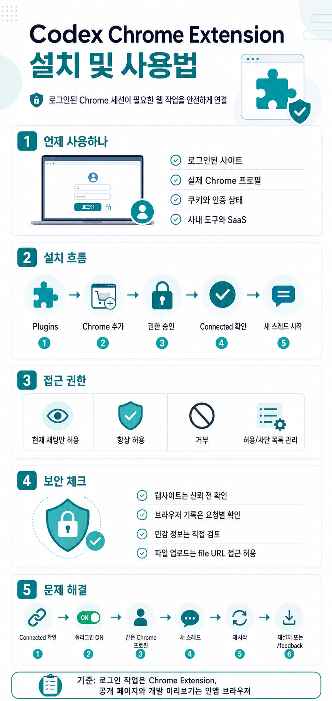

# Codex Chrome Extension 설치 및 사용법

> 공식 문서: https://developers.openai.com/codex/app/chrome-extension

## 인포그래픽 요약



## 개요

Codex Chrome Extension은 Codex가 사용자의 Chrome 브라우저를 활용해 웹 작업을 수행할 수 있게 해주는 확장 기능이다. 특히 로그인된 브라우저 상태가 필요한 사이트에서 유용하다. 예를 들어 LinkedIn, Salesforce, Gmail, 사내 도구처럼 로그인 세션이나 실제 Chrome 프로필이 필요한 작업에 사용할 수 있다.

반대로 로컬 개발 서버, 파일 기반 미리보기, 로그인 없이 볼 수 있는 공개 페이지는 먼저 Codex의 인앱 브라우저를 사용하는 것이 권장된다. 인앱 브라우저는 미리보기와 검증 작업을 Codex 안에서 처리하므로 개인 Chrome 프로필을 사용할 필요가 없다.

Codex는 작업 성격에 따라 전용 플러그인, Chrome, 인앱 브라우저를 전환해 사용할 수 있다. 다만 웹페이지 내용은 신뢰할 수 없는 컨텍스트로 취급하고, Codex가 계속 진행하도록 허용하기 전에 사용자가 사이트와 작업 내용을 확인하는 것이 좋다.

## 설치 방법

1. Codex 앱을 열고 `Plugins`로 이동한다.
2. `Chrome` 플러그인을 추가한다.
3. 안내되는 설정 흐름에 따라 Chrome Extension 설치 또는 연결을 진행한다.
4. Chrome 권한 요청을 승인한다.
5. Chrome에서 Codex Extension 상태가 `Connected`로 표시되는지 확인한다.
6. 플러그인 설정이 끝나면 새 Codex 스레드를 시작한다.

설치 후에는 Codex가 로그인된 웹사이트 작업이 필요할 때 Chrome 사용을 제안할 수 있다. 직접 호출하려면 프롬프트에서 `@Chrome`을 사용할 수 있다.

```text
@Chrome open Salesforce and update the account from these call notes.
```

Chrome이 열려 있지 않으면 Codex가 Chrome을 열 수 있다. Chrome 브라우저 작업은 스레드별 탭 그룹으로 묶여, 한 작업의 브라우저 흐름을 구분하기 쉽게 관리한다.

## 웹사이트 접근 권한 관리

기본적으로 Codex는 새 웹사이트와 상호작용하기 전에 사용자에게 확인을 요청한다. 이때 기준은 `example.com` 같은 웹사이트 호스트다.

Codex가 웹사이트 사용을 요청하면 다음 중 하나를 선택할 수 있다.

- 현재 채팅에서만 해당 웹사이트 허용
- 해당 호스트를 항상 허용
- 해당 웹사이트 거부

### 허용 목록과 차단 목록

Computer Use 설정에서 도메인 허용 목록과 차단 목록을 관리할 수 있다.

- 허용 목록: Codex가 다시 묻지 않고 사용할 수 있는 도메인
- 차단 목록: Codex가 사용하지 않아야 하는 도메인

허용 목록에서 도메인을 제거하면 Codex가 다음 사용 시 다시 확인을 요청한다. 차단 목록에서 제거하면 Codex가 해당 도메인을 완전히 차단된 것으로 보지 않고 다시 허용 여부를 물을 수 있다.

### 항상 브라우저 콘텐츠 허용

`Always allow browser content`를 켜면 Codex가 웹사이트를 사용할 때 매번 확인을 요청하지 않는다. 편리하지만 위험도가 높아질 수 있으므로, 신뢰할 수 있는 작업 환경에서만 신중하게 사용하는 것이 좋다.

### 브라우저 기록

브라우저 기록에는 내부 URL, 검색어, 다른 기기에서 동기화된 활동 같은 민감한 정보가 포함될 수 있다. Codex가 브라우저 기록을 사용하려면 요청별 확인이 필요하며, 브라우저 기록에는 항상 허용 옵션이 없다.

## 데이터 및 보안

### Chrome Extension 권한

Chrome Extension 설치 시 Chrome이 권한 승인을 요청할 수 있다. 공식 문서에 따르면 권한 요청에는 다음 항목들이 포함될 수 있다.

- 페이지 디버거 접근
- 모든 웹사이트의 데이터 읽기 및 변경
- 로그인된 기기의 브라우징 기록 읽기 및 변경
- 알림 표시
- 북마크 읽기 및 변경
- 다운로드 관리
- 협력하는 네이티브 애플리케이션과 통신
- 탭 그룹 보기 및 관리

이 권한들은 확장 기능이 브라우저 워크플로를 수행할 수 있게 해준다. 하지만 Codex는 실제 작업 중에도 자체 확인 절차, 설정, 허용 목록, 차단 목록을 통해 웹사이트나 브라우저 기록 사용을 제어한다.

### Memories 설정

Chrome 사용은 Codex Memories 설정을 따른다. Memories가 켜져 있으면 Codex가 Chrome 작업 중 관련 저장 메모리를 활용할 수 있다. Memories가 꺼져 있으면 브라우저 작업에서도 메모리를 사용하지 않는다.

### OpenAI에 저장되는 브라우징 정보

OpenAI는 Chrome Extension에서 수행한 모든 브라우저 행동을 별도의 완전한 기록으로 저장하지 않는다. 다만 Codex가 페이지에서 읽은 텍스트, 스크린샷, 도구 호출, 요약, 메시지처럼 스레드 컨텍스트에 포함된 브라우저 활동은 저장될 수 있다.

비밀 정보나 매우 민감한 데이터는 꼭 필요한 경우가 아니라면 브라우저 작업으로 전달하지 않는 것이 좋다. 필요한 경우에도 사용자가 직접 확인하면서 진행해야 한다.

## 파일 업로드 설정

Chrome 작업에서 컴퓨터의 파일을 업로드해야 한다면 Codex Extension이 파일 URL에 접근할 수 있도록 설정해야 한다.

1. Chrome 툴바에서 확장 프로그램 아이콘을 연다.
2. `Manage Extensions`를 클릭한다.
3. Codex Extension 카드에서 `Details`를 클릭한다.
4. `Allow access to file URLs`를 켠다.
5. 설정을 변경한 뒤 Chrome 작업을 다시 시작한다.

## 문제 해결

Codex가 Chrome에 연결하지 못하면 먼저 접근하려는 웹사이트가 Settings의 차단 목록에 들어 있지 않은지 확인한다. 차단된 사이트가 아니라면 아래 순서로 점검한다.

1. Chrome 툴바 또는 확장 프로그램 메뉴에서 Codex Extension을 열고 `Connected` 상태인지 확인한다.
2. `Disconnected` 상태이거나 native host 누락 메시지가 보이면 Codex의 `Plugins`에서 Chrome 플러그인을 제거한 뒤 다시 추가하고 설정 흐름을 다시 따른다.
3. Codex 앱의 `Plugins`에서 Chrome 플러그인이 켜져 있는지 확인한다.
4. Codex Extension이 설치된 Chrome 프로필과 현재 사용하는 Chrome 프로필이 같은지 확인한다.
5. 새 Codex 스레드를 시작해 Chrome 작업을 다시 시도한다.
6. Chrome과 Codex를 재시작한 뒤 다시 시도한다.
7. 그래도 연결되지 않으면 Codex Chrome Extension을 제거하고, Codex의 Chrome 플러그인을 제거 후 다시 추가한 다음 설정을 다시 진행한다.
8. Extension이 `Connected`인데도 Codex가 Chrome을 사용할 수 없다면 Codex 앱에서 `/feedback`을 실행하고, 지원 문의 시 thread ID를 함께 제공한다.

## 언제 Chrome Extension을 쓰면 좋은가

Chrome Extension은 다음 상황에 적합하다.

- 로그인된 사용자 세션이 필요한 웹사이트 작업
- 사용자의 실제 Chrome 프로필, 쿠키, 인증 상태가 필요한 작업
- 회사 내부 도구나 외부 SaaS에서 데이터를 확인하거나 입력해야 하는 작업
- 사용자가 직접 화면과 권한 요청을 확인하면서 진행해야 하는 민감한 브라우저 작업

다음 상황에서는 먼저 인앱 브라우저를 고려한다.

- localhost 개발 서버 확인
- 파일 기반 HTML 미리보기
- 로그인 없는 공개 웹페이지 확인
- 개인 Chrome 프로필이 필요 없는 단순 페이지 검증

## 요약

Codex Chrome Extension은 Codex가 사용자의 실제 Chrome 환경에서 작업할 수 있게 해주는 강력한 도구다. 로그인된 사이트 작업에는 편리하지만, 확장 권한과 브라우저 데이터 접근이 포함되므로 웹사이트 허용, 브라우저 기록 접근, 파일 URL 접근 같은 설정을 신중하게 관리해야 한다.

실무에서는 “로그인 상태가 필요한 작업은 Chrome Extension, 개발 미리보기나 공개 페이지는 인앱 브라우저”라는 기준으로 사용하면 안전하고 효율적이다.
