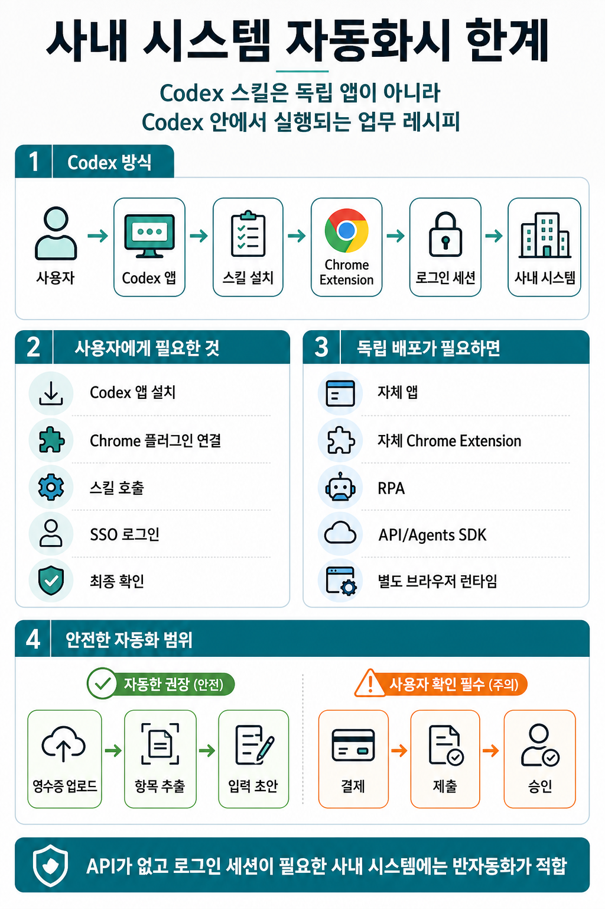

# 사내 시스템 자동화시 한계

## 인포그래픽 요약

Codex Chrome Extension은 GSCM, ERP, myFinance 같은 사내 시스템 자동화에 유용하지만, **Codex 앱과 연동되는 방식**이라는 점을 이해해야 한다.

특히 “경비 처리 자동화 스킬”처럼 반복 업무를 스킬로 만들었다면, 그 스킬은 독립 실행 프로그램이라기보다 **Codex가 업무를 수행하도록 안내하는 워크플로 지침**에 가깝다. 따라서 다른 사람이 사용하려면 일반적으로 Codex 앱 안에서 스킬을 설치하고 호출해야 한다.

## 핵심 결론

**Codex 스킬 + Codex Chrome Extension 방식으로 배포한다면 사용자는 Codex에서 해당 스킬을 설치하고 실행해야 한다.**

Codex Chrome Extension은 일반적인 독립 자동화 런타임이 아니라, Codex가 사용자의 Chrome 브라우저를 활용할 수 있게 해주는 연결 통로다. 공식 문서에서도 Chrome Extension은 Codex가 로그인된 브라우저 상태가 필요한 작업에 Chrome을 사용할 수 있게 해주는 기능으로 설명된다.

공식 문서: https://developers.openai.com/codex/app/chrome-extension

## 예시: 경비 처리 자동화 스킬

예를 들어 다음과 같은 경비 처리 자동화 스킬을 만들었다고 가정한다.

1. SSO 로그인
2. myFinance 접속
3. 영수증 업로드
4. 업로드한 영수증에서 경비 처리에 필요한 항목 확인
5. 경비 처리에 필요한 항목 입력
6. 결제 또는 제출

이 스킬을 다른 사람이 사용하려면 보통 다음 흐름이 필요하다.

1. 사용자가 Codex 앱을 설치한다.
2. Codex에서 Chrome 플러그인과 Chrome Extension을 설치하고 연결한다.
3. 사용자가 배포받은 경비 처리 스킬을 설치한다.
4. Codex에서 해당 스킬을 호출한다.
5. 사용자가 SSO 로그인과 필요한 권한 승인을 진행한다.
6. Codex가 Chrome을 통해 myFinance 화면을 조작한다.
7. 사용자가 최종 제출, 결제, 승인 같은 중요한 단계를 확인한다.

즉, 이 방식은 “스킬만 배포하면 Chrome에서 혼자 실행되는 자동화”가 아니라 **Codex 앱을 실행 환경으로 사용하는 자동화**다.

## Chrome Extension만 따로 배포할 수 있는가

Codex Chrome Extension만 따로 배포해서 독립 자동화 도구처럼 사용하는 방식은 적합하지 않다.

Codex Chrome Extension은 Codex 앱과 연결되어 동작하는 확장 기능이다. 사용자의 Chrome 브라우저를 Codex가 사용할 수 있도록 해주는 역할이지, 별도의 업무 자동화 제품을 실행하는 범용 엔진은 아니다.

따라서 “우리 경비 처리 스킬만 설치하면 Codex 없이 Chrome에서 자동으로 실행된다”는 구조를 기대하면 안 된다.

## Codex 없이 배포하려면

Codex 없이 다른 사람이 독립적으로 사용할 수 있는 자동화 제품을 만들고 싶다면 별도 구현이 필요하다.

가능한 방식은 다음과 같다.

- 사내 전용 웹 자동화 앱
- Playwright 기반 데스크톱 자동화 도구
- 자체 Chrome Extension
- RPA 도구
- OpenAI API 또는 Agents SDK와 별도 브라우저 자동화 런타임 조합
- 사내 시스템 API가 있다면 API 기반 자동화

이 경우에는 Codex 스킬이 아니라 실행 가능한 앱, 서비스, 확장 프로그램, RPA 워크플로로 만들어야 한다.

## Codex 스킬 방식의 장점

Codex 앱을 실행 환경으로 사용하는 방식에도 장점은 있다.

- 스킬 형태로 업무 절차를 문서화하고 반복 사용할 수 있다.
- 사용자의 실제 Chrome 로그인 세션을 활용할 수 있다.
- SSO, VPN, 2FA 같은 사내 인증 흐름과 함께 사용할 수 있다.
- 사용자가 화면을 보면서 승인할 수 있다.
- 위험한 작업 전에 사람 확인 단계를 넣기 쉽다.

특히 API가 없고 로그인 세션이 필요한 사내 시스템에서는 도입 장벽이 낮다.

## Codex 스킬 방식의 한계

반대로 다음 한계도 있다.

- 사용자가 Codex 앱을 설치해야 한다.
- Chrome 플러그인과 Chrome Extension 설정이 필요하다.
- 스킬은 Codex 안에서 호출해야 한다.
- Codex 계정, 권한, 플러그인 설정에 의존한다.
- 완전 무인 자동화보다는 사람 확인이 포함된 반자동화에 적합하다.
- 사내 보안 정책상 브라우저 자동화 허용 여부를 확인해야 한다.

## 결제, 제출, 승인 단계는 주의

경비 처리 자동화에서 가장 조심해야 할 부분은 마지막 단계다.

영수증 업로드, 항목 추출, 경비 항목 입력 초안 작성까지는 자동화 효과가 크다. 하지만 결제, 제출, 승인, 정산 같은 단계는 업무상 영향이 크기 때문에 사용자가 직접 확인하는 구조가 안전하다.

권장 방식은 다음과 같다.

1. Codex가 영수증을 업로드한다.
2. Codex가 필요한 항목을 추출한다.
3. Codex가 myFinance 입력 화면에 초안을 채운다.
4. 사용자가 금액, 계정과목, 거래처, 결제일, 증빙을 확인한다.
5. 사용자가 최종 제출 또는 결제를 진행한다.

즉, **Codex는 업무 보조자 역할을 하고, 최종 책임이 있는 클릭은 사용자가 확인하는 구조**가 좋다.

## 정리

Codex Chrome Extension을 활용한 사내 시스템 자동화는 다음과 같이 이해하면 된다.

- 팀원들이 Codex를 사용한다면: Codex 스킬로 배포하는 방식이 적합하다.
- Codex 없이 누구나 쓰는 자동화 제품이 필요하다면: 별도 앱, RPA, 자체 Chrome Extension, API 기반 자동화를 구현해야 한다.
- API가 없고 로그인 세션이 필요한 사내 시스템이라면: Codex Chrome Extension은 반자동화 도구로 매우 유용하다.
- 결제, 제출, 승인처럼 영향이 큰 작업은: 반드시 사용자 확인 단계를 두는 것이 안전하다.

결론적으로, Codex 스킬은 “배포 가능한 독립 앱”이라기보다 **Codex 안에서 재사용하는 업무 자동화 레시피**에 가깝다. 사내 시스템 자동화에 활용할 수 있지만, 실행 환경은 Codex 앱과 Chrome Extension에 의존한다.
