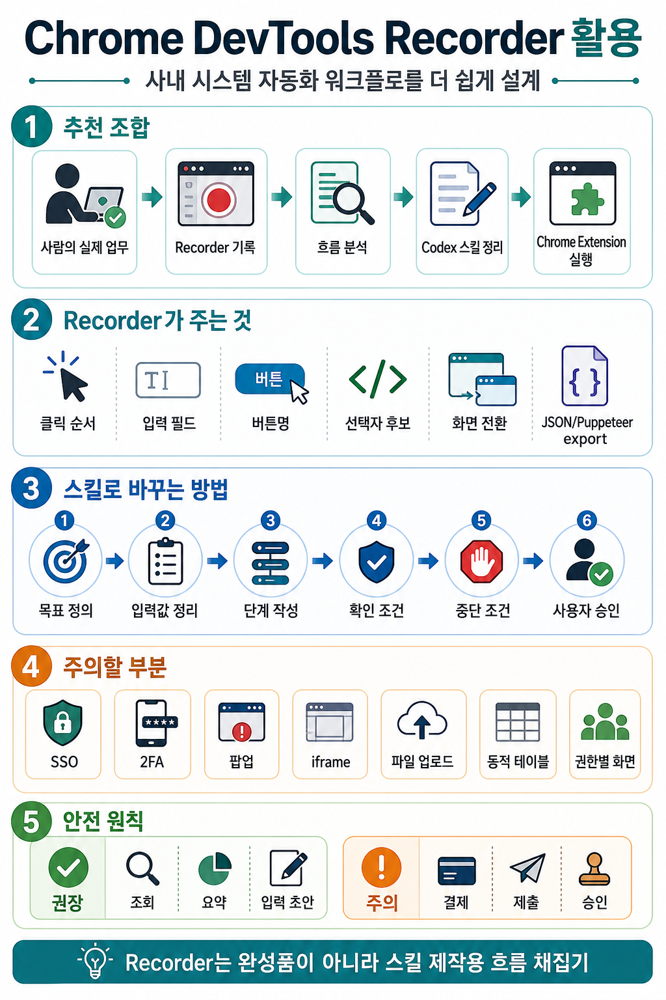

# Chrome DevTools Recorder와 함께 워크플로 만들기

## 인포그래픽 요약



사내 시스템 자동화 워크플로를 만들 때 **Codex + Chrome 플러그인 + Chrome DevTools Recorder**를 함께 사용하면 스킬이나 업무 자동화 절차를 훨씬 쉽게 설계할 수 있다.

Chrome DevTools Recorder는 완성된 Codex 스킬을 자동으로 만들어주는 도구는 아니다. 대신 사람이 실제로 사내 시스템에서 클릭하고 입력하는 흐름을 기록해, Codex 스킬을 만들 때 필요한 **업무 단계, 화면 흐름, 버튼명, 입력 필드, 선택자 후보**를 빠르게 수집하는 도구로 볼 수 있다.

공식 문서: https://developer.chrome.com/docs/devtools/recorder/overview

## 핵심 결론

Chrome DevTools Recorder는 **스킬 제작용 흐름 채집기**로 유용하다.

권장 흐름은 다음과 같다.

1. 사람이 실제 업무를 수행한다.
2. Chrome DevTools Recorder로 클릭과 입력 흐름을 기록한다.
3. 기록된 단계에서 화면 전환, 버튼, 입력 필드, 선택자 후보를 확인한다.
4. Recorder 결과를 Codex 스킬 지침으로 정리한다.
5. Codex와 Chrome Extension으로 실행하면서 예외와 안전장치를 보완한다.

즉, Recorder는 스킬의 최종 형태가 아니라 **초안과 근거 자료**를 만드는 데 좋다.

## 왜 도움이 되는가

사내 시스템 자동화는 화면 구조를 먼저 정확히 파악해야 한다. 예를 들어 myFinance 경비 처리 업무를 자동화하려면 다음과 같은 정보를 알아야 한다.

- 어느 메뉴에서 경비 처리 화면으로 들어가는가
- 영수증 업로드 버튼은 어디에 있는가
- 필수 입력 필드는 무엇인가
- 화면 전환 후 어떤 상태를 기다려야 하는가
- 제출 전에 어떤 요약 정보를 확인해야 하는가

Recorder를 사용하면 이런 정보를 사람이 직접 정리하는 부담을 줄일 수 있다.

## Recorder로 얻을 수 있는 것

Chrome DevTools Recorder를 사용하면 다음 자료를 얻을 수 있다.

- 실제 클릭 순서
- 입력 필드와 버튼의 선택자 후보
- 화면 전환 흐름
- 반복 업무의 기본 시나리오
- Puppeteer 또는 JSON 형태의 export 결과
- Codex 스킬에 넣을 단계별 참고 자료

이 자료는 Codex 스킬을 작성할 때 “어떤 화면에서 무엇을 찾아야 하는지”를 구체화하는 데 도움이 된다.

## Codex 스킬로 바꾸는 방식

Recorder 결과를 그대로 스킬에 붙이는 것보다는, Codex가 이해하기 쉬운 업무 지침으로 다시 정리하는 것이 좋다.

예를 들어 Recorder가 기록한 클릭 흐름은 다음과 같은 스킬 단계로 바꿀 수 있다.

```md
1. myFinance에 접속한다.
2. 좌측 메뉴에서 "경비 처리"를 연다.
3. "영수증 업로드" 버튼을 찾는다.
4. 사용자가 지정한 영수증 파일을 업로드한다.
5. 화면에 추출된 금액, 날짜, 가맹점명을 읽는다.
6. 누락된 항목이 있으면 사용자에게 확인한다.
7. 경비 항목 초안을 입력한다.
8. 제출 전 요약을 사용자에게 보여주고 확인을 받는다.
9. 사용자가 승인한 경우에만 제출 버튼을 누른다.
```

이렇게 정리하면 Codex는 단순 클릭 순서가 아니라, 업무 목적과 안전 조건을 함께 이해할 수 있다.

## 함께 쓰면 좋은 구조

사내 시스템 자동화 스킬을 만들 때는 다음 구조가 좋다.

1. Recorder로 실제 업무 흐름을 캡처한다.
2. Codex가 Recorder 결과를 읽고 업무 단계를 정리한다.
3. 사람이 단계별 의도와 예외 조건을 보완한다.
4. Codex 스킬에 목표, 입력값, 단계, 확인 조건, 중단 조건을 명시한다.
5. Codex Chrome Extension으로 실제 로그인 세션에서 테스트한다.
6. 제출, 승인, 결제 같은 위험 단계는 사용자 확인을 넣는다.

## 주의할 점

Recorder가 만든 결과가 곧바로 안정적인 사내 자동화가 되는 것은 아니다.

다음 부분은 반드시 사람이 보완해야 한다.

- SSO 로그인 흐름
- 2FA 또는 OTP 입력
- 팝업과 새 창
- iframe 내부 화면
- 파일 업로드
- 동적 테이블과 검색 결과
- 권한별로 달라지는 화면
- 네트워크 지연과 로딩 상태
- 제출, 승인, 결제 같은 고위험 버튼

특히 결제, 제출, 승인 단계는 자동 클릭보다 사용자 확인 단계를 두는 것이 안전하다.

## 좋은 활용 예

### myFinance 경비 처리

Recorder로 다음 흐름을 기록한다.

1. myFinance 접속
2. 경비 처리 메뉴 진입
3. 영수증 업로드 버튼 클릭
4. 파일 업로드
5. 항목 추출 결과 확인
6. 필수 필드 입력
7. 제출 전 검토 화면 확인

이후 Codex 스킬에는 “추출 결과가 비어 있으면 사용자에게 물어보기”, “금액과 계정과목은 제출 전 반드시 확인받기” 같은 안전 규칙을 추가한다.

### ERP 거래처 조회

Recorder로 거래처 검색 화면에 들어가 검색하는 흐름을 기록한다. 이후 Codex 스킬에는 검색어 입력, 결과 목록 확인, 사업자번호와 담당자 정보 요약, 결과가 여러 개인 경우 사용자에게 선택 요청 같은 규칙을 추가한다.

### GSCM 주문 상태 확인

Recorder로 주문 번호 검색 흐름을 기록한다. 이후 Codex 스킬에는 주문 상태, 납기, 입고 여부, 예외 건 정리 기준을 추가한다.

## 정리

Chrome DevTools Recorder를 Codex와 함께 사용하면 사내 시스템 자동화 스킬을 만들 때 초기 분석 시간이 줄어든다.

다만 Recorder는 완성품이 아니라 초안 생성 도구다. 최종 스킬은 Codex가 이해하기 쉬운 업무 지침, 예외 처리, 사용자 확인 조건, 안전장치를 중심으로 다시 정리해야 한다.

결론적으로, **Recorder는 업무 흐름을 빠르게 채집하고, Codex는 그 흐름을 재사용 가능한 스킬로 정리하는 역할**을 맡기면 좋다.
