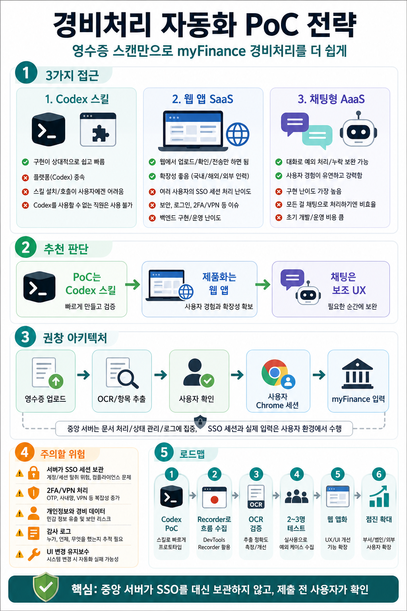

# 경비처리 자동화 PoC

## 인포그래픽 요약



영수증 스캔만 가지고 사내 경비처리 시스템인 myFinance에 접속해 경비처리를 자동화하려면, 단순 자동화 스크립트가 아니라 **여러 사람이 안전하게 사용할 수 있는 사내 업무 제품** 관점으로 접근해야 한다.

나 혼자 쓰는 자동화라면 Codex 스킬이나 브라우저 자동화만으로도 충분할 수 있다. 하지만 여러 사람이 사용하는 순간부터는 UX/UI, 배포, 권한, 보안, 유지보수, 감사 로그, 장애 대응까지 함께 고려해야 한다.

## 현재 고민 중인 3가지 방향

### 1. Codex 기반 스킬로 만들어 배포

Codex 스킬로 경비처리 자동화 절차를 만들고, 사용자가 Codex에서 해당 스킬을 호출하는 방식이다.

장점은 구현이 상대적으로 빠르다는 점이다. Codex와 Chrome Extension을 활용하면 로그인된 브라우저 세션에서 myFinance 화면을 조작하는 PoC를 빠르게 만들 수 있다.

단점도 분명하다.

- Codex 플랫폼에 종속된다.
- Codex를 사용할 수 없는 직원은 쓸 수 없다.
- 외주 용역, 행정 지원 인력 등에게 배포하기 어렵다.
- 스킬 설치와 호출 방식이 일반 사용자에게는 낯설 수 있다.
- 사용자 경험이 제품이라기보다 에이전트 호출에 가깝다.

따라서 이 방식은 최종 제품보다는 **MVP와 업무 흐름 검증용**으로 적합하다.

## 2. 경비 처리 SaaS 웹 앱

사용자가 웹에 접속해 영수증을 업로드하고 필요한 항목만 확인한 뒤 전송 버튼을 누르면, 백엔드 또는 에이전트가 myFinance 처리를 수행하는 방식이다.

사용자 입장에서는 가장 깔끔하다.

- 웹에 접속한다.
- 영수증을 업로드한다.
- 추출된 항목을 확인한다.
- 전송 버튼을 누른다.
- 경비처리 결과를 확인한다.

웹 기반이므로 국내 직원뿐 아니라 해외 법인이나 외부 협업 인력까지 확장하기 쉽다.

하지만 가장 큰 난점은 **여러 사람의 SSO 로그인 정보와 세션을 어떻게 처리할 것인가**다. 백엔드 서버가 각 사용자의 SSO 세션을 대신 들고 Chrome을 실행하는 구조는 보안과 운영 난도가 매우 높다.

특히 다음 문제가 생길 수 있다.

- 사용자 SSO 계정 또는 세션 보관 문제
- 2FA, OTP, 사내망, VPN 처리 문제
- 개인정보와 경비 데이터 보안 문제
- 누가 어떤 항목을 입력했는지에 대한 감사 로그 문제
- 브라우저 자동화 실패 시 복구 문제
- myFinance UI 변경에 따른 유지보수 문제

따라서 웹 앱을 만들더라도, 중앙 서버가 사용자의 SSO를 대신 보관하고 실행하는 구조는 신중해야 한다.

## 3. 경비 처리 AaaS 또는 채팅형 에이전트

채팅을 기본 UX로 두고, 사용자가 에이전트와 대화하면서 경비처리를 진행하는 방식이다. 예를 들어 Vercel처럼 사용자가 요청하고, 에이전트가 함께 만들어가는 경험을 제공할 수 있다.

이 방식은 예외 처리에는 강하다.

- 영수증 항목이 애매할 때 질문할 수 있다.
- 누락된 정보만 사용자에게 물어볼 수 있다.
- 사용자가 자연어로 상황을 설명할 수 있다.
- 규칙이 복잡한 경비 항목을 대화로 보완할 수 있다.

하지만 구현 난도는 가장 높다. 그리고 경비처리처럼 반복 양식이 많은 업무는 모든 것을 채팅으로 처리하는 것보다, **폼 기반 UI + 필요한 순간만 챗봇** 구조가 더 편할 수 있다.

예시는 다음과 같다.

```text
영수증 업로드
→ 자동 추출 결과를 폼으로 표시
→ 누락되거나 애매한 항목만 챗으로 질문
→ 사용자가 최종 확인
→ myFinance에 반영
```

## 추천 방향

바로 큰 제품을 만들기보다는, 다음 순서가 현실적이다.

1. Codex 스킬로 PoC를 만든다.
2. Chrome DevTools Recorder로 myFinance 실제 흐름을 수집한다.
3. 영수증 OCR과 경비 항목 추출 정확도를 검증한다.
4. 제출 전 사용자 확인까지 포함한 반자동화 흐름을 만든다.
5. 내부 사용자 2~3명으로 테스트한다.
6. 예외 케이스와 실패 패턴을 모은다.
7. 이후 웹 앱으로 제품화한다.

즉, **Codex 스킬은 시작점으로 좋고, 최종 제품은 웹 앱이 더 적합하다.**

## 추천 아키텍처

웹 앱을 만들 경우, 백엔드가 여러 사람의 SSO 세션을 대신 들고 Chrome을 실행하는 구조보다는 다음 구조가 더 안전하다.

```text
사용자 웹 앱
  → 영수증 업로드
  → OCR 및 항목 추출
  → 사용자 확인
  → 사용자 PC의 Chrome 세션 또는 승인된 로컬 실행기
  → myFinance 입력
  → 제출 전 사용자 확인
```

핵심은 **중앙 서버가 사용자의 SSO 비밀번호나 세션을 보관하지 않는 것**이다.

서버는 다음 역할에 집중하는 것이 좋다.

- 영수증 파일 업로드
- OCR 및 항목 추출
- 사용자 입력값 관리
- 작업 상태 관리
- 감사 로그 저장
- 파일 보관 정책 적용
- 실패 이력과 재시도 관리

실제 myFinance 입력은 사용자의 로그인된 브라우저 세션 또는 사내에서 승인한 로컬 실행기를 통해 처리하는 방식을 검토할 수 있다.

## UX/UI 고려사항

여러 사람이 쓰려면 사용자는 자동화 내부 구조를 몰라도 되어야 한다.

좋은 UX는 다음 흐름에 가깝다.

1. 영수증 업로드
2. 자동 추출 결과 확인
3. 누락 항목만 입력
4. 경비 항목 미리보기
5. 제출 전 최종 확인
6. 처리 결과 확인

사용자에게 보여줘야 할 정보는 명확해야 한다.

- 금액
- 결제일
- 가맹점명
- 계정과목
- 비용 부서
- 프로젝트 또는 코스트센터
- 증빙 파일
- 제출 대상 시스템
- 제출 전 변경 요약

## 보안 및 운영 고려사항

경비처리 자동화는 민감한 업무다. 다음 원칙이 필요하다.

- 사용자 SSO 비밀번호를 서버에 저장하지 않는다.
- 사용자 세션을 중앙 서버가 장기간 보관하지 않는다.
- 결제, 제출, 승인은 사용자 확인 후 진행한다.
- 누가, 언제, 어떤 영수증으로, 어떤 항목을 입력했는지 감사 로그를 남긴다.
- 실패한 작업은 중간 상태를 복구할 수 있어야 한다.
- 영수증 원본과 추출 데이터의 보관 기간을 정한다.
- 외주나 행정 인력이 사용할 경우 권한 범위를 분리한다.
- myFinance UI 변경에 대응할 유지보수 체계를 둔다.

## 가장 조심해야 할 부분

가장 위험한 구조는 중앙 백엔드가 여러 사용자의 SSO 정보를 보관하고, 서버에서 각 사용자 대신 Chrome을 실행하는 방식이다.

이 구조는 사용자 입장에서는 편해 보이지만, 보안과 감사 측면에서 위험도가 높다.

가능하다면 다음 방향이 더 안전하다.

- 중앙 서버는 문서 처리와 상태 관리에 집중한다.
- 사용자 인증과 myFinance 세션은 사용자 환경에 둔다.
- 자동 입력은 사용자 세션에서 수행한다.
- 최종 제출은 사용자 확인을 받는다.

## 결론

경비처리 자동화를 여러 사람이 쓰게 만들려면 Codex 스킬만으로는 한계가 있다.

하지만 Codex 스킬은 초기 PoC와 업무 흐름 검증에는 매우 좋다. 빠르게 만들어 보고, 실제 myFinance 화면에서 어떤 예외가 나오는지, 영수증 OCR 정확도는 어느 정도인지, 사용자가 어디서 확인해야 하는지 파악할 수 있다.

최종적으로는 웹 앱 형태가 더 적합하다. 다만 백엔드가 모든 사용자의 SSO 세션을 대신 처리하는 방식은 피하고, **웹 앱 + 사용자 로컬 또는 브라우저 세션 실행 구조**를 우선 검토하는 것이 좋다.

정리하면 다음과 같다.

- 시작은 Codex 스킬 PoC로 빠르게 검증한다.
- 실제 사용자 테스트로 예외와 UX 요구사항을 모은다.
- 제품화는 웹 앱 중심으로 설계한다.
- SSO 세션은 중앙 서버가 보관하지 않는 방향을 우선 검토한다.
- 결제, 제출, 승인은 사용자 확인을 거친다.
