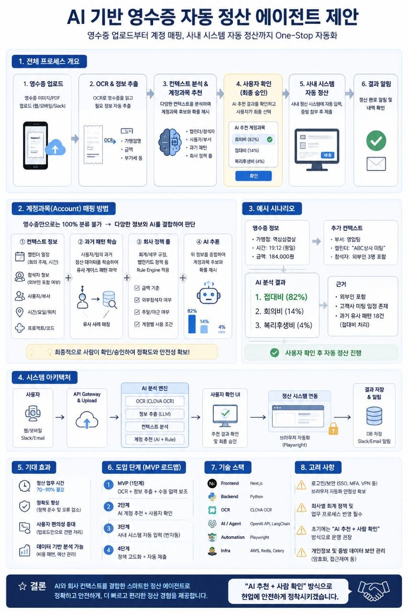

# AI 기반 영수증 자동 정산 에이전트 제안

## 인포그래픽 요약



## 개요

영수증 정산 업무는 겉으로 보기에는 단순해 보이지만, 실제로는 반복 입력과 판단이 함께 들어가는 업무다. 금액, 날짜, 가맹점명처럼 영수증에서 바로 읽을 수 있는 정보도 있지만, 계정과목, 비용 부서, 프로젝트, 접대 목적처럼 회사 정책과 업무 맥락을 함께 봐야 하는 정보도 있다.

따라서 영수증 자동 정산은 단순 OCR만으로 끝나지 않는다. OCR은 영수증의 텍스트를 읽는 역할이고, 실제 자동화의 핵심은 **읽어낸 정보를 회사의 정산 규칙과 사용자 맥락에 맞게 해석하는 것**이다.

이 글에서는 영수증 업로드부터 OCR 추출, AI 계정과목 추천, 사용자 확인, 사내 시스템 입력까지 이어지는 AI 기반 정산 에이전트 구조를 정리한다.

## 목표 흐름

목표는 사용자가 영수증을 업로드하면, 에이전트가 필요한 정보를 추출하고 계정과목을 추천한 뒤, 사용자가 확인하면 사내 정산 시스템에 반영하는 구조다.

전체 흐름은 다음과 같다.

```text
1. 사용자가 영수증을 업로드한다.
2. OCR이 날짜, 금액, 가맹점명, 사업자번호, 품목 등을 추출한다.
3. AI가 사용자, 부서, 프로젝트, 과거 정산 패턴, 회사 규정을 함께 분석한다.
4. 적절한 계정과목과 정산 사유를 추천한다.
5. 사용자가 추천 결과를 확인하고 수정한다.
6. 에이전트가 사내 정산 시스템에 입력한다.
7. 처리 결과와 실패 여부를 사용자에게 알린다.
```

여기서 중요한 점은 처음부터 모든 것을 완전 자동으로 제출하지 않는 것이다. 정산 업무는 회계, 감사, 내부통제와 연결되므로, 초기에는 **AI 추천 + 사람 확인** 구조가 더 안전하다.

## 왜 OCR만으로는 부족한가

OCR은 영수증에서 보이는 텍스트를 읽는 데 강하다. 예를 들어 다음 정보는 비교적 자동 추출하기 쉽다.

- 결제일
- 결제 시간
- 가맹점명
- 총 금액
- 부가세
- 사업자번호
- 카드 승인번호
- 품목명

하지만 실제 정산에서는 이 정보만으로 계정과목을 확정하기 어렵다.

예를 들어 같은 식당 영수증이라도 상황에 따라 계정과목이 달라질 수 있다.

```text
고객 미팅 후 식사       -> 접대비
팀 내부 회의 중 식사     -> 회의비
야근 식대               -> 복리후생비 또는 식대
교육 참석 중 식사        -> 교육훈련비 관련 비용
출장 중 식사             -> 여비교통비 또는 출장비
```

즉, 영수증의 텍스트보다 더 중요한 것은 **왜 이 비용이 발생했는지**다. 이 맥락을 해석하려면 사용자 입력, 일정, 부서 정보, 프로젝트, 과거 패턴, 회사 정책을 함께 봐야 한다.

## AI 계정과목 추천 방식

AI는 OCR 결과만 보는 것이 아니라 여러 정보를 조합해 계정과목을 추천할 수 있다.

예를 들어 다음과 같은 입력이 있을 수 있다.

```text
영수증 정보:
- 가맹점: 한식당
- 금액: 184,000원
- 결제일: 2026-05-13
- 품목: 식사

사용자 맥락:
- 영업팀 소속
- 같은 시간대 고객 미팅 일정 있음
- 참석자 4명
- 과거 유사 영수증은 접대비로 처리됨

회사 정책:
- 고객 미팅 식사는 접대비
- 내부 회의 식사는 회의비
- 개인 식사는 복리후생비 또는 식대 기준 적용
```

이 경우 AI는 다음처럼 추천할 수 있다.

```text
추천 계정과목: 접대비
신뢰도: 82%
대안 후보:
- 회의비 14%
- 복리후생비 4%
추천 사유:
- 고객 미팅 일정과 결제 시간이 일치함
- 과거 유사 정산이 접대비로 처리됨
- 참석 인원과 금액이 접대비 정책 범위에 들어옴
```

이런 방식이면 사용자는 모든 항목을 처음부터 입력하지 않아도 된다. AI가 초안을 만들고, 사용자는 틀린 부분만 고치면 된다.

## 추천 아키텍처

현실적인 시스템 구조는 다음과 같다.

```text
사용자 채널
- 웹 앱
- Slack
- Email
- 사내 포털

입력 계층
- 영수증 업로드
- 메타데이터 입력
- 사용자 인증

분석 계층
- OCR 처리
- 영수증 정보 정규화
- 회사 정책 검색
- 과거 정산 패턴 조회
- AI 계정과목 추천

확인 계층
- 추천 결과 표시
- 사용자 수정
- 제출 전 최종 확인

자동화 계층
- 사내 정산 시스템 API 연동
- API가 없을 경우 Playwright 기반 브라우저 자동화
- 실패 시 재시도 및 수동 처리 안내

운영 계층
- 정산 이력 저장
- 감사 로그
- 실패 로그
- 알림
```

기술 스택은 다음처럼 구성할 수 있다.

- Frontend: Next.js
- Backend: Python 또는 Node.js
- OCR: CLOVA OCR, Google Vision, AWS Textract 등
- AI 분석: OpenAI API, LangChain, RAG 기반 정책 검색
- 자동화: Playwright 또는 Puppeteer
- Queue: Redis, Celery
- Infra: AWS, 사내 서버, S3 호환 스토리지
- Database: PostgreSQL

## API 연동과 브라우저 자동화

가장 좋은 방식은 사내 정산 시스템이 API를 제공하는 것이다. API가 있으면 인증, 입력, 상태 조회, 오류 처리를 안정적으로 설계할 수 있다.

하지만 실제 사내 SaaS나 내부 시스템에서는 API가 없거나, 필요한 기능이 API로 열려 있지 않은 경우가 많다. 이 경우에는 브라우저 자동화를 검토할 수 있다.

```text
사용자가 정산 내용을 확인한다.
-> 에이전트가 사내 정산 시스템을 연다.
-> 필요한 메뉴로 이동한다.
-> 금액, 날짜, 가맹점, 계정과목, 사유를 입력한다.
-> 증빙 파일을 첨부한다.
-> 제출 직전 화면에서 멈춘다.
-> 사용자가 최종 확인 후 제출한다.
```

여기서도 핵심은 제출 직전에서 멈추는 것이다. 자동화가 초안을 입력하더라도, 최종 책임이 따르는 제출은 사용자가 확인하고 진행하는 구조가 안전하다.

## MVP 범위

처음부터 완전한 정산 에이전트를 만들기보다, 작은 범위에서 검증하는 것이 좋다.

추천 MVP는 다음과 같다.

```text
1단계: 영수증 이미지 업로드
2단계: OCR로 기본 정보 추출
3단계: 계정과목 후보 2~3개 추천
4단계: 사용자가 최종 계정과목 선택
5단계: 정산 시스템 입력용 JSON 또는 폼 데이터 생성
6단계: 일부 케이스에 한해 Playwright로 입력 자동화
7단계: 실패 케이스와 수정 이력 수집
```

이 단계에서는 완전 자동 제출보다 추천 정확도와 사용자 확인 UX를 검증하는 것이 중요하다.

특히 먼저 검증해야 할 것은 다음이다.

- OCR이 실제 영수증을 얼마나 잘 읽는가
- 계정과목 추천이 업무 담당자 기준으로 납득 가능한가
- 사용자가 수정해야 하는 항목이 얼마나 줄어드는가
- 사내 정산 시스템 입력 자동화가 안정적으로 동작하는가
- 실패했을 때 사용자가 어디서 이어서 처리할 수 있는가

## 사용자 확인 UI

사용자 확인 화면은 자동화 품질을 결정하는 중요한 지점이다. AI가 아무리 잘 추천해도 사용자가 이해할 수 없으면 신뢰하기 어렵다.

확인 화면에는 다음 정보가 보여야 한다.

- 영수증 원본 이미지
- OCR 추출 결과
- 추천 계정과목
- 추천 신뢰도
- 대안 계정과목
- 추천 사유
- 회사 정책 근거
- 사용자가 수정할 수 있는 입력 필드
- 제출 전 변경 요약

예시는 다음과 같다.

```text
AI 추천 결과

계정과목: 접대비
신뢰도: 82%
추천 사유:
- 고객 미팅 일정과 결제 시간이 일치합니다.
- 과거 유사 정산이 접대비로 처리되었습니다.
- 참석자 수와 금액이 접대비 기준 범위에 있습니다.

대안:
- 회의비
- 복리후생비

[접대비로 진행]
[회의비로 변경]
[직접 수정]
```

이렇게 추천 사유를 함께 보여주면 사용자는 AI 판단을 검토할 수 있다. 단순히 “접대비 추천”만 보여주는 것보다 훨씬 안전하다.

## 보안 및 운영 고려사항

영수증 정산은 개인정보, 결제 정보, 회사 비용 정보가 포함되는 업무다. 따라서 자동화 설계에서 보안과 운영을 처음부터 고려해야 한다.

필요한 원칙은 다음과 같다.

- 사용자 SSO 비밀번호를 서버에 저장하지 않는다.
- 사용자 세션을 중앙 서버가 장기간 보관하지 않는다.
- 영수증 원본과 OCR 결과의 보관 기간을 정한다.
- 감사 로그를 남긴다.
- 누가, 언제, 어떤 영수증을, 어떤 계정과목으로 처리했는지 기록한다.
- AI 추천 결과와 사용자의 최종 수정 내역을 함께 저장한다.
- 민감정보는 로그에 남기지 않는다.
- 제출, 승인, 결재 같은 액션은 사용자 확인 후 진행한다.
- 실패 시 사용자가 수동으로 이어서 처리할 수 있어야 한다.

특히 회사 정책 반영은 중요하다. 같은 영수증이라도 회사마다 계정과목 기준이 다를 수 있다. 따라서 AI 모델의 일반 지식에만 맡기지 말고, 회사 내부 규정과 과거 정산 데이터를 함께 참조하는 구조가 필요하다.

## 기대 효과

이 구조가 잘 동작하면 다음 효과를 기대할 수 있다.

- 사용자의 정산 입력 시간이 줄어든다.
- 반복적인 금액, 날짜, 가맹점 입력 실수가 줄어든다.
- 계정과목 선택 기준이 더 일관된다.
- 신규 직원도 회사 정산 규칙을 쉽게 따라갈 수 있다.
- 회계팀은 수정 요청과 반려 케이스를 줄일 수 있다.
- 축적된 데이터를 기반으로 비용 패턴을 분석할 수 있다.

특히 단순 OCR이 아니라 회사 맥락을 반영한 AI 추천까지 들어가면, 자동화의 체감 효용이 커진다. 사용자는 영수증을 올리고 확인만 하면 되고, 시스템은 반복 입력과 1차 판단을 대신 수행한다.

## 정리

AI 기반 영수증 자동 정산 에이전트의 핵심은 OCR이 아니다. OCR은 시작점이고, 실제 가치는 **회사 맥락을 이해한 계정과목 추천과 안전한 사용자 확인 흐름**에서 나온다.

현실적인 접근은 다음과 같다.

```text
영수증을 업로드한다.
OCR로 기본 정보를 추출한다.
AI가 회사 정책과 과거 패턴을 참고해 계정과목을 추천한다.
사용자가 추천 결과를 확인하고 수정한다.
에이전트가 정산 시스템 입력을 돕는다.
최종 제출은 사용자가 확인한다.
```

처음부터 완전 자동 정산을 목표로 하기보다, **AI 추천 + 사람 확인 + 제출 직전 자동 입력** 구조로 시작하는 것이 좋다. 이 방식은 정확도와 안전성을 함께 확보하면서, 실제 업무 시간을 줄이는 데 충분한 효과를 낼 수 있다.

이후 추천 정확도, 실패 패턴, 사용자 수정 이력이 쌓이면 회사별 정책 반영과 자동화 범위를 점진적으로 넓힐 수 있다. 그렇게 접근하면 영수증 정산은 단순 반복 업무에서, 데이터와 AI가 함께 처리하는 스마트한 업무 흐름으로 바뀔 수 있다.
