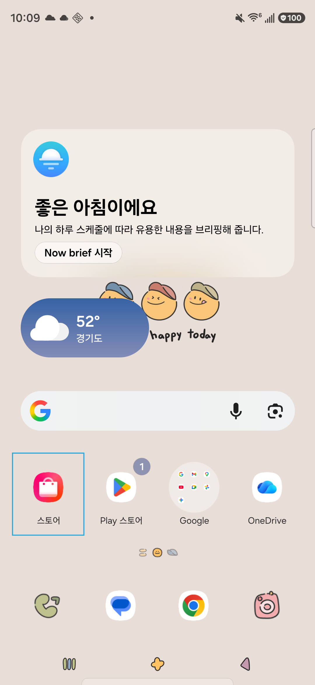
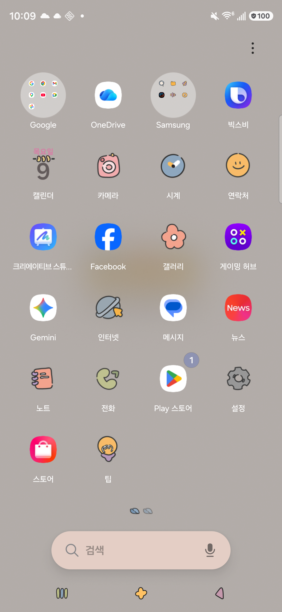
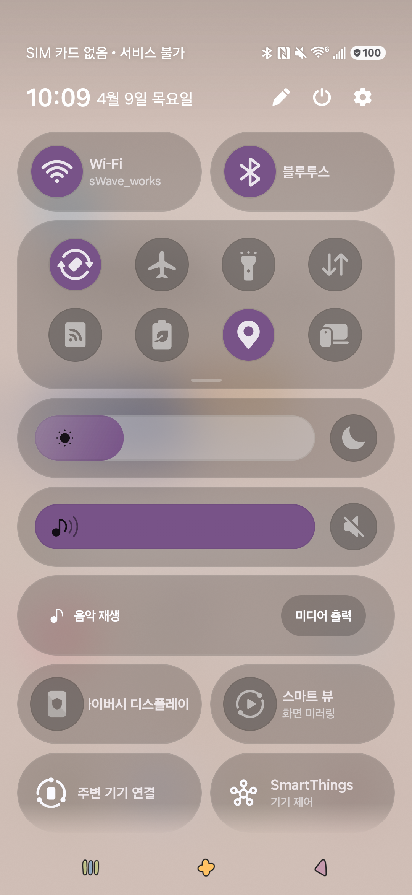
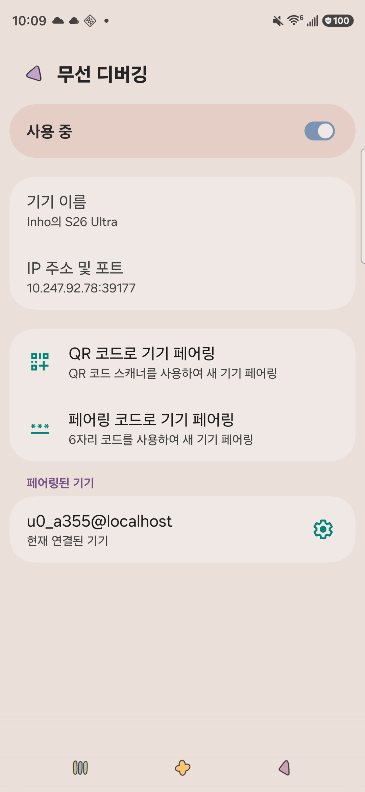
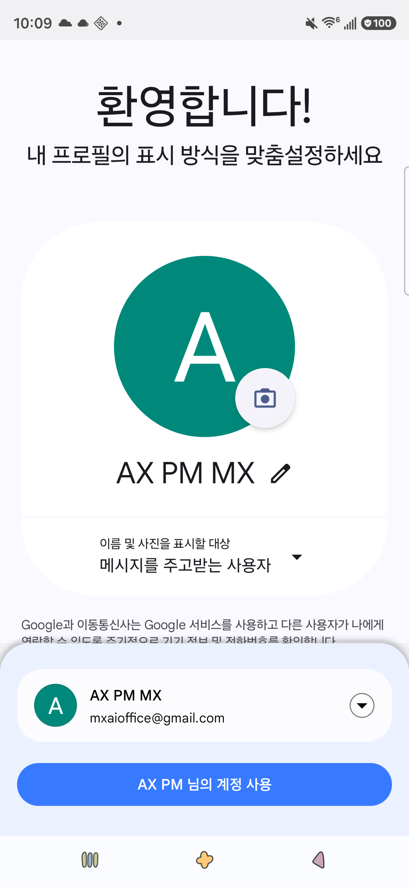
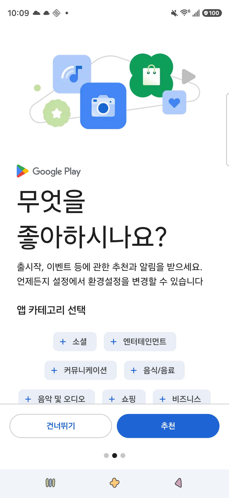
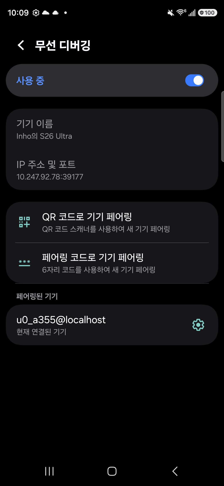
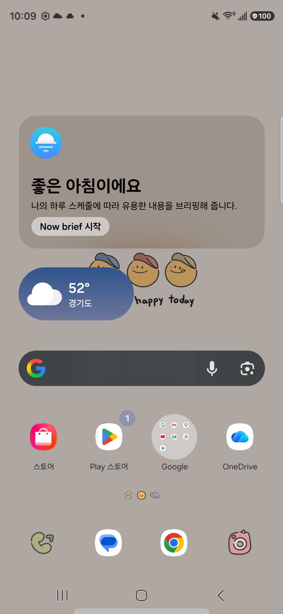
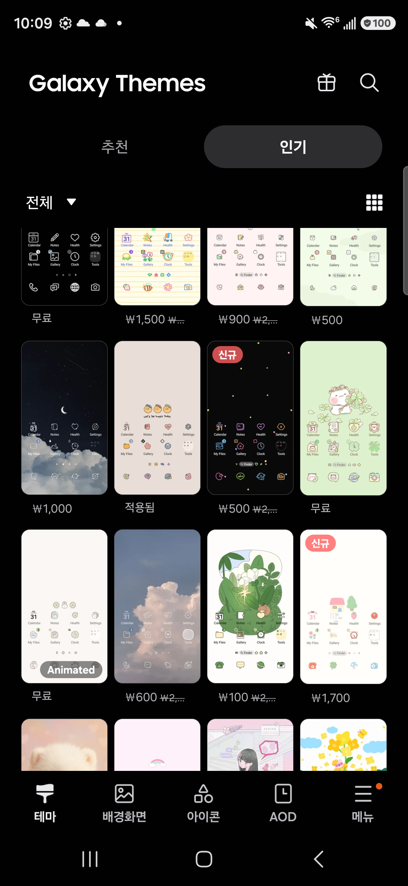

# 테마 시인성 검증 결과

대상 테마: `[조토리] 꾸러기 스마일`
캡처 폴더: `~/PRJs/Theme/screencapture`

목적: 테스트 케이스별 스크린샷을 연결해 검수/판정 기록을 남긴다.

판정 기준:
- O = 양호
- △ = 애매
- X = 문제 있음

---

## TC-01 홈 화면 1초 인지 테스트
- 캡처: `screencapture/TestCase1.png`
- 확인 목적: 시간, 날씨, 대표 아이콘의 즉시 인지 여부
- 판정: 
- 메모: 

---

## TC-02 홈 화면 장시간 보기 피로도 테스트
- 캡처: `screencapture/TestCase2.png`
- 확인 목적: 홈 화면 장시간 응시 시 피로도 여부
- 판정: 
- 메모: 

---

## TC-03 앱 아이콘 식별 테스트
- 캡처: `screencapture/TestCase3.png`
- 확인 목적: 앱 서랍/아이콘팩 적용 시 아이콘 구분성
- 판정: 
- 메모: 

---

## TC-04 알림창/빠른 설정 패널 대비 테스트
- 캡처: `screencapture/TestCase4.png`
- 확인 목적: 알림/토글/상단 정보의 대비와 가독성
- 판정: 
- 메모: 

---

## TC-05 설정 앱 목록 가독성 테스트
- 캡처: `screencapture/TestCase5.png`
- 확인 목적: 리스트형 메뉴에서 제목/부제/아이콘 가독성
- 판정: 
- 메모: 

---

## TC-06 메시지/채팅 화면 가독성 테스트
- 캡처: `screencapture/TestCase6.png`
- 확인 목적: 말풍선/입력창/시간표시 시인성
- 판정: 
- 메모: 

---

## TC-07 밝은 배경 앱 가독성 테스트
- 캡처: `screencapture/TestCase7.png`
- 확인 목적: 밝은 배경에서 텍스트/버튼/강조색 대비
- 판정: 
- 메모: 

---

## TC-08 다크 모드 호환성 테스트
- 캡처: `screencapture/TestCase8.png`
- 확인 목적: 다크 모드에서 텍스트/아이콘/강조색 대비
- 판정: 
- 메모: 

---

## TC-09 고밝기/실외 환경 가정 테스트
- 캡처: `screencapture/TestCase9.png`
- 확인 목적: 고밝기 상태에서 연한 텍스트/아이콘 식별성
- 판정: 
- 메모: 

---

## TC-10 오조작 유발 여부 테스트
- 캡처: `screencapture/TestCase10.png`
- 확인 목적: 버튼/탭/선택 상태의 직관성
- 판정: 
- 메모: 

---

## 종합 결과
- 전체 판정 요약:
- 장점:
- 개선 필요:
- 재적용/테마 변경 필요 여부:
