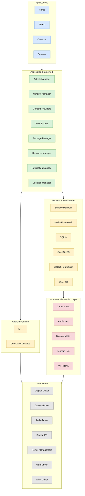

```mermaid
flowchart TB
    classDef top fill:#d7e8ff,stroke:#7aa7e8,color:#111,stroke-width:1px;
    classDef framework fill:#d9f2d9,stroke:#7dbb7d,color:#111,stroke-width:1px;
    classDef runtime fill:#fff1c9,stroke:#d6b656,color:#111,stroke-width:1px;
    classDef hal fill:#f8d7da,stroke:#d28a94,color:#111,stroke-width:1px;
    classDef kernel fill:#e6e6e6,stroke:#999,color:#111,stroke-width:1px;

    subgraph APPS[Applications]
        A1[Home]
        A2[Phone]
        A3[Contacts]
        A4[Browser]
    end

    subgraph FW[Application Framework]
        F1[Activity Manager]
        F2[Window Manager]
        F3[Content Providers]
        F4[View System]
        F5[Package Manager]
        F6[Resource Manager]
        F7[Notification Manager]
        F8[Location Manager]
    end

    subgraph RT[Android Runtime]
        R1[ART]
        R2[Core Java Libraries]
    end

    subgraph LIBS[Native C/C++ Libraries]
        L1[Surface Manager]
        L2[Media Framework]
        L3[SQLite]
        L4[OpenGL ES]
        L5[WebKit / Chromium]
        L6[SSL / libc]
    end

    subgraph HAL[Hardware Abstraction Layer]
        H1[Camera HAL]
        H2[Audio HAL]
        H3[Bluetooth HAL]
        H4[Sensors HAL]
        H5[Wi‑Fi HAL]
    end

    subgraph KERNEL[Linux Kernel]
        K1[Display Driver]
        K2[Camera Driver]
        K3[Audio Driver]
        K4[Binder IPC]
        K5[Power Management]
        K6[USB Driver]
        K7[Wi‑Fi Driver]
    end

    APPS --> FW
    FW --> RT
    FW --> LIBS
    LIBS --> HAL
    RT --> KERNEL
    HAL --> KERNEL

    class A1,A2,A3,A4 top
    class F1,F2,F3,F4,F5,F6,F7,F8 framework
    class R1,R2 runtime
    class L1,L2,L3,L4,L5,L6 runtime
    class H1,H2,H3,H4,H5 hal
    class K1,K2,K3,K4,K5,K6,K7 kernel
```
