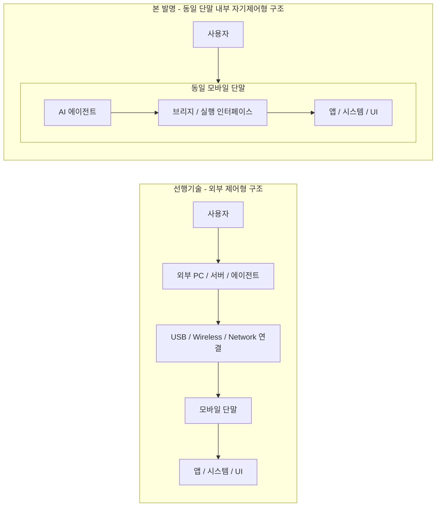

# Architecture Comparison v1

의도: **선행은 밖에서 제어하고, 본발명은 단말 안에 제어 주체와 제어 경로가 함께 들어 있다**는 점을 가장 단순하게 보여주는 비교도.

```mermaid
flowchart LR
    subgraph A[선행기술 - 외부 제어형 구조]
        U1[사용자] --> P1[외부 PC / 서버 / 에이전트]
        P1 --> C1[USB / Wireless / Network 연결]
        C1 --> D1[모바일 단말]
        D1 --> T1[앱 / 시스템 / UI]
    end

    subgraph B[본 발명 - 동일 단말 내부 자기제어형 구조]
        U2[사용자] --> D2
        subgraph D2[동일 모바일 단말]
            A2[AI 에이전트]
            B2[브리지 / 실행 인터페이스]
            T2[앱 / 시스템 / UI]
            A2 --> B2 --> T2
        end
    end
```
