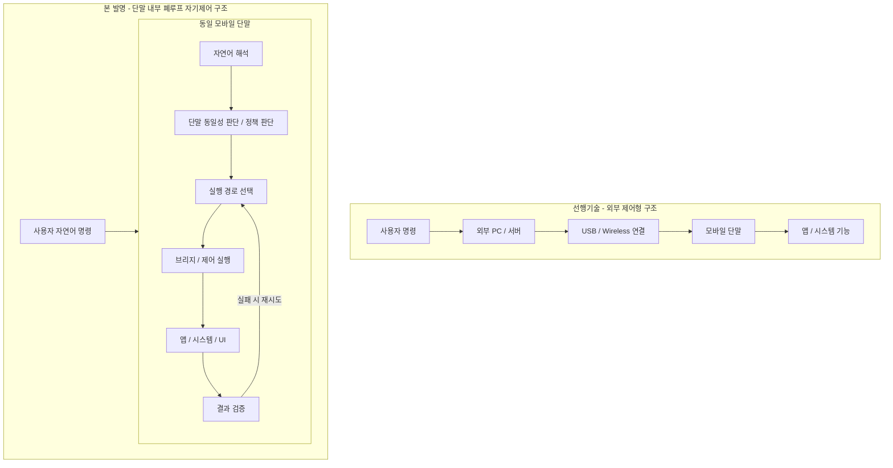

# Architecture Comparison v2

의도: **본발명은 단말 안에서 자연어 해석부터 실행, 검증, 재시도까지 폐루프로 돈다**는 점을 강조한 비교도.

```mermaid
flowchart TB
    subgraph A[선행기술 - 외부 제어형 구조]
        U1[사용자 명령] --> P1[외부 PC / 서버]
        P1 --> L1[USB / Wireless 연결]
        L1 --> D1[모바일 단말]
        D1 --> T1[앱 / 시스템 기능]
    end

    subgraph B[본 발명 - 단말 내부 폐루프 자기제어 구조]
        U2[사용자 자연어 명령] --> PHONE
        subgraph PHONE[동일 모바일 단말]
            N2[자연어 해석]
            S2[단말 동일성 판단 / 정책 판단]
            R2[실행 경로 선택]
            X2[브리지 / 제어 실행]
            T2[앱 / 시스템 / UI]
            V2[결과 검증]
            N2 --> S2 --> R2 --> X2 --> T2 --> V2
            V2 -->|실패 시 재시도| R2
        end
    end
```
