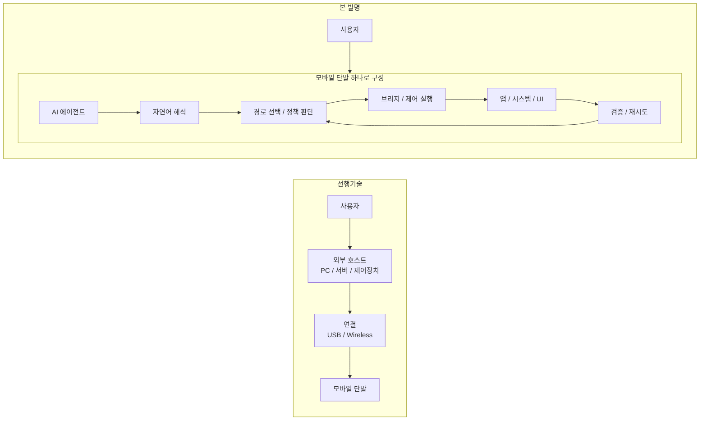

# Architecture Comparison v3

의도: **‘단말 안에 다 들어 있네, 그래서 편하겠네’** 라는 인상을 가장 직접적으로 주기 위한 시안.

```mermaid
flowchart LR
    subgraph A[선행기술]
        U1[사용자]
        H1[외부 호스트\nPC / 서버 / 제어장치]
        C1[연결\nUSB / Wireless]
        P1[모바일 단말]
        U1 --> H1 --> C1 --> P1
    end

    subgraph B[본 발명]
        U2[사용자]
        subgraph P2[모바일 단말 하나로 구성]
            A2[AI 에이전트]
            N2[자연어 해석]
            R2[경로 선택 / 정책 판단]
            B2[브리지 / 제어 실행]
            T2[앱 / 시스템 / UI]
            V2[검증 / 재시도]
            A2 --> N2 --> R2 --> B2 --> T2 --> V2
            V2 --> R2
        end
        U2 --> P2
    end
```
