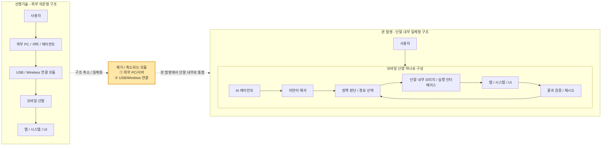

# Architecture Comparison v4

의도: **선행기술에서는 외부 PC와 연결 모듈이 별도로 필요하지만, 본발명에서는 그 두 모듈이 제거되고 단말 내부로 일체화된다**는 점을 강조하는 비교도.

## 설명 문안
종래기술은 일반적으로 외부 PC 또는 서버와 같은 별도 제어 주체와, 해당 제어 주체를 모바일 단말에 연결하기 위한 USB 또는 무선 연결 모듈을 필요로 한다. 반면 본 발명은 인공지능 에이전트가 동일 모바일 단말 내부에서 실행되고, 단말 내부 브리지 또는 실행 인터페이스를 통해 동일 단말의 앱, 시스템 기능 및 사용자 인터페이스를 직접 제어하므로, 종래기술에서 요구되던 **외부 제어용 호스트 모듈** 및 **외부 연결 모듈**이 구조적으로 축소 또는 제거된다. 따라서 사용자는 별도의 외부 장치 없이 하나의 모바일 단말만으로 자연어 기반 자기 단말 제어를 수행할 수 있다.

## 핵심 메시지
1. 선행기술은 외부 PC/서버와 연결 모듈이 필요하다.
2. 본 발명은 그 기능을 단말 내부 구조로 흡수한다.
3. 결과적으로 **'단말 안에 다 들어 있는 자기제어 구조'** 가 된다.
