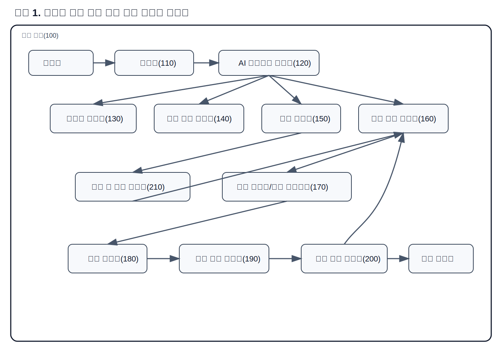
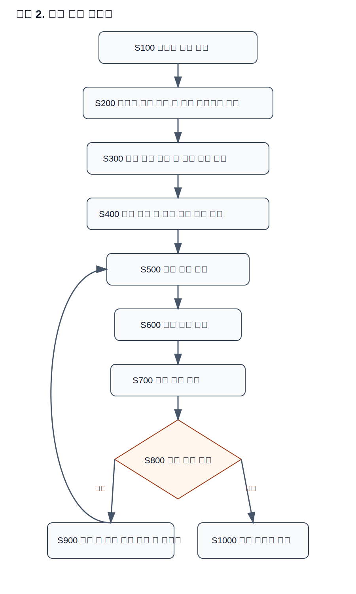
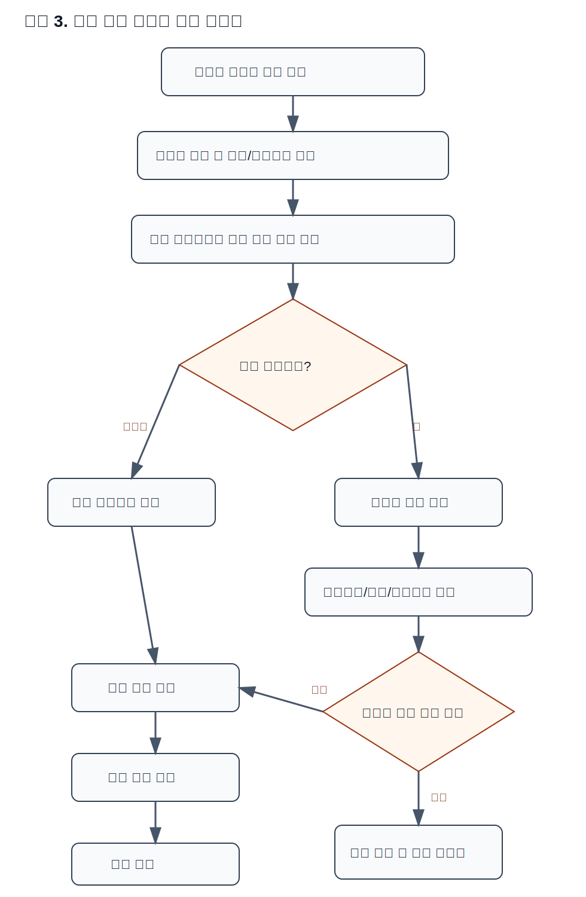
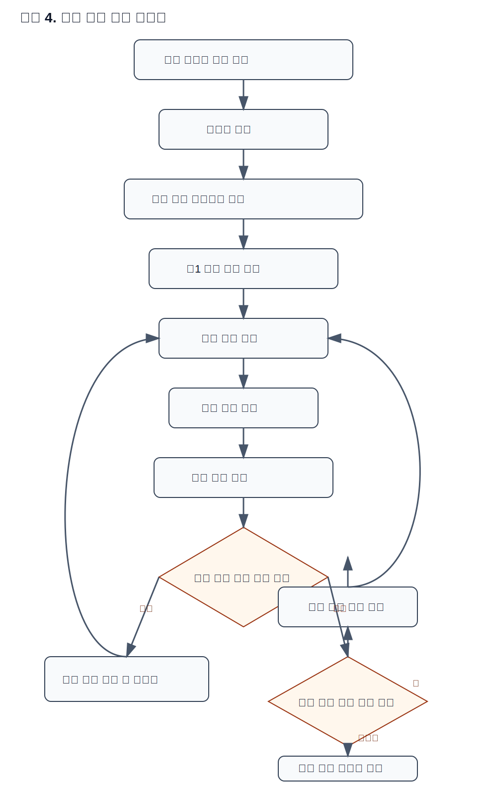

# 직무발명 신고서 초안 v3

## 발명의 명칭
- **국문:** 동일 모바일 단말 내 인공지능 에이전트를 이용한 자연어 기반 자기 단말 제어 장치 및 방법
- **영문:** Apparatus and Method for Natural Language-Based Self-Device Control Using an Artificial Intelligence Agent on the Same Mobile Terminal

---

# 1. 발명의 배경

## 가. 본 발명의 기술분야
본 발명은 모바일 단말 내부에서 실행되는 인공지능 에이전트(Artificial Intelligence Agent)가 사용자의 자연어 명령을 해석하고, 해석된 결과에 따라 동일 모바일 단말의 애플리케이션, 운영체제 기능 및 시스템 설정을 직접 제어하는 기술 분야에 관한 것이다. 보다 구체적으로는, 본 발명은 자연어 처리(Natural Language Processing), 온디바이스 인공지능(On-device Artificial Intelligence), 모바일 자동화(Mobile Automation), 운영체제 인터페이스 제어, 무선 디버깅 브리지(Wireless Debugging Bridge) 또는 로컬 브리지(Local Bridge), 실행 결과 검증(Execution Result Verification) 및 실패 시 대체 경로 선택(Fallback Path Selection)을 포함하는 폐루프 제어(Closed-loop Control) 기술 분야에 속한다.

종래의 모바일 단말 제어 기술은 외부 개인용 컴퓨터(Personal Computer), 서버 또는 별도 제어 장치가 모바일 단말을 원격 또는 보조적으로 제어하는 구조가 일반적이었다. 또한 사용자가 사전에 정의한 스크립트, 매크로 또는 접근성 기반 자동화 도구를 이용하여 일부 반복 작업을 수행하는 방식이 사용되어 왔다. 그러나 이러한 방식은 동일 모바일 단말 내부에서 자연어를 직접 입력받아 자기 단말을 제어하는 구조와는 차이가 있다.

특히, 동일 모바일 단말 내에서 동작하는 인공지능 에이전트가 사용자 명령의 의미를 이해하고, 제어 대상이 자기 단말임을 식별하며, 정책 판단에 따라 민감 작업 여부를 판정한 다음, 복수의 실행 경로 중 적합한 경로를 선택하여 제어를 수행하고, 그 결과를 검증한 후 실패 시 다른 경로로 재실행하는 구조는 기존 모바일 자동화 기술과 차별되는 기술적 과제를 가진다. 본 발명은 이러한 문제를 해결하기 위해, 단말 내부의 논리적 모듈 간 관계를 구조화하고 각 모듈 간 입력/출력 정보를 이용하여 자연어 기반 자기 단말 제어를 실현하는 장치 및 방법을 제안한다.

## 나. 종래기술의 설명

### - 종래기술의 목적/구성/효과

#### ① 목적 :
종래기술의 목적은 모바일 단말의 앱 실행, 설정 변경, 정보 조회 또는 반복 동작 자동화를 보다 편리하게 수행하는 데 있다. 이를 위해 외부 호스트 기반 디버깅 인터페이스, 매크로 기반 자동화 도구, 음성 비서 또는 접근성 기반 제어 방식이 사용되어 왔다.

#### ② 구성 :
종래기술은 대체로 다음과 같은 구성으로 이루어진다.
- 외부 호스트 또는 서버
- 모바일 단말과 통신하는 디버깅 인터페이스
- 앱 실행 또는 설정 변경을 수행하는 제어 스크립트
- 접근성 서비스 또는 사용자 인터페이스(User Interface) 조작 모듈
- 일부 음성 명령 처리 모듈

#### ③ 효과 :
종래기술은 일부 반복 작업을 자동화하거나 외부 장치를 통해 단말을 제어할 수 있다는 효과가 있다. 또한 제한적인 음성 명령 또는 규칙 기반 자동화 기능을 통해 사용자의 조작 부담을 줄일 수 있다.

### - 종래기술의 문제점
종래기술은 다음과 같은 문제점을 가진다.

첫째, 외부 개인용 컴퓨터 또는 서버 의존성이 높아 동일 단말 단독으로 즉시 활용하기 어렵다.

둘째, 사용자의 자연어 명령을 직접 해석하여 의도와 실행 파라미터를 추출하고, 이를 즉시 단말 제어 시퀀스로 변환하는 구조가 부족하다.

셋째, 실행 이후 실제 목표 상태에 도달하였는지를 확인하는 검증 구조가 미흡하다. 즉, 명령은 전송되더라도 실제 제어 성공 여부를 정밀하게 확인하지 못하는 경우가 많다.

넷째, 하나의 실행 경로가 실패하였을 때 다른 제어 수단으로 자동 전환하는 대체 경로 선택 구조가 부족하여, 제어 신뢰성이 낮다.

다섯째, 전화 발신, 메시지 전송, 파일 삭제, 금융 애플리케이션 접근, 권한 변경 등 민감 작업에 대해 체계적인 사용자 확인 경계가 부족하다.

여섯째, 동일 단말 내부에서 실행되는 인공지능 에이전트가 현재 제어 대상이 자기 단말임을 식별하고, 단말 모델, 운영체제 버전, 권한 상태 및 설치 앱 상태를 반영하여 제어 경로를 다르게 선택하는 구조가 충분히 제시되어 있지 않다.

### - 종래기술과 본 발명의 차이점
본 발명은 종래기술과 비교할 때 다음과 같은 차이점을 가진다.

1. 동일 모바일 단말 내부에서 실행되는 인공지능 에이전트가 사용자의 자연어 명령을 직접 해석하여 자기 단말 제어를 수행한다.
2. 자연어 해석부, 자기 단말 인식부, 정책 판단부, 실행 경로 선택부, 제어 실행부, 실행 결과 검증부 및 대체 경로 선택부를 포함하는 폐루프 제어 구조를 가진다.
3. 운영체제 API(Application Programming Interface), 시스템 인텐트(Intent), 접근성 기반 사용자 인터페이스 제어, 무선 디버깅 브리지 또는 로컬 브리지 등 복수의 실행 경로를 선택적으로 사용할 수 있다.
4. 민감 작업에 대해서는 추가 사용자 확인 또는 인증 절차를 수행함으로써 보안성과 안전성을 향상시킨다.
5. 복합 자연어 명령을 복수의 하위 작업으로 분해하여 순차적 또는 부분 병렬적으로 처리할 수 있다.
6. 개발자 모드에서는 앱 빌드, 설치, 실행 및 테스트 제어를 동일 단말 내에서 통합 수행할 수 있다.

---

# 2. 발명(고안)의 구체적 설명 – 대표 실시예

## 가. 발명의 핵심 포인트(구조/기능)
본 발명의 핵심 포인트는 동일 모바일 단말 내부에서 실행되는 인공지능 에이전트가 사용자의 자연어 명령을 입력받아 자기 단말을 직접 제어하되, 단순 명령 실행에 그치지 않고 **[핵심 포인트 1] 자연어 해석**, **[핵심 포인트 2] 자기 단말 식별**, **[핵심 포인트 3] 민감 작업 정책 판단**, **[핵심 포인트 4] 복수 실행 경로 선택**, **[핵심 포인트 5] 실행 결과 검증**, **[핵심 포인트 6] 실패 시 대체 경로 재선택**을 포함하는 구조를 가진다는 점이다.

또한 본 발명은 인공지능 에이전트와 단말 제어 실행부 사이에 무선 디버깅 브리지 또는 로컬 브리지를 배치함으로써, 운영체제 수준의 제어 경로와 접근성 기반 사용자 인터페이스 제어 경로를 유기적으로 결합할 수 있다. 각 모듈은 입력 데이터와 출력 데이터를 명확히 가진다. 예를 들어, 자연어 해석부는 자연어 명령을 입력으로 받아 의도 및 실행 파라미터를 출력하고, 정책 판단부는 상기 의도 및 실행 파라미터를 입력으로 받아 민감도 정보 및 확인 필요 여부를 출력하며, 실행 결과 검증부는 제어 결과 상태정보를 입력으로 받아 성공/실패 판단 결과를 출력한다.

본 발명은 단순 자동화 스크립트와 달리, 단말 상태 및 과거 성공 이력을 반영하여 실행 경로를 선택하는 구조를 포함할 수 있으며, 동일 명령에 대해서도 단말 모델, 운영체제 버전 또는 앱 상태에 따라 상이한 제어 시나리오를 수행할 수 있다.

## 나. 발명의 구성 요소

### ① 평면, 단면 사시도
본 발명은 주로 소프트웨어 및 논리 모듈 중심의 발명이므로, 기계적 구조의 평면도나 단면도보다는 논리 블록 구성도 및 사용자 인터페이스 흐름도가 핵심 도면에 해당한다. 다만 디바이스 레벨에서는 동일 모바일 단말 내에 입력부, 인공지능 에이전트 실행부, 제어 실행부 및 결과 검증부가 논리적으로 배치되는 구조로 설명할 수 있다.

### ② 단계별 동작도/순서도(Flow-chart, Block diagram)

#### (1) 시스템 구성도
본 발명의 대표 실시예에 따른 자연어 기반 자기 단말 제어 시스템은 다음의 구성요소를 포함할 수 있다.
- **100: 자기 단말**
- **110: 입력부**
- **120: AI 에이전트 실행부**
- **130: 자연어 해석부**
- **140: 자기 단말 인식부**
- **150: 정책 판단부**
- **160: 실행 경로 선택부**
- **170: 무선 디버깅 브리지부 또는 로컬 브리지부**
- **180: 제어 실행부**
- **190: 실행 결과 검증부**
- **200: 대체 경로 선택부**
- **210: 권한 및 보안 관리부**

상기 입력부(110)는 사용자 텍스트 명령 또는 음성 명령을 수신한다. AI 에이전트 실행부(120)는 전체 동작 흐름을 오케스트레이션(Orchestration)한다. 자연어 해석부(130)는 명령 의도 및 실행 파라미터를 산출하고, 자기 단말 인식부(140)는 단말 모델명, 운영체제 버전, 화면 특성, 설치 앱 목록, 권한 상태 및 로컬 식별 토큰 중 적어도 하나를 이용하여 제어 대상이 자기 단말인지 판단한다. 정책 판단부(150)는 민감 작업 여부를 판정하고, 실행 경로 선택부(160)는 복수의 제어 수단 중 적절한 경로를 선택한다. 무선 디버깅 브리지부 또는 로컬 브리지부(170)는 제어 명령을 중계하고, 제어 실행부(180)는 실제 단말 제어를 수행한다. 실행 결과 검증부(190)는 상태 정보를 수집하여 성공 여부를 판단하고, 대체 경로 선택부(200)는 실패 시 재시도를 위한 다른 경로를 선택한다. 권한 및 보안 관리부(210)는 사용자 승인, 권한 점검, 민감 정보 보호를 담당한다.

#### (2) 기본 동작 순서도
본 발명의 대표 실시예는 다음 단계로 수행될 수 있다.
- **【S100】 사용자 명령 수신**
- **【S200】 자연어 명령 해석 및 실행 파라미터 추출**
- **【S300】 자기 단말 식별 및 단말 상태 확인**
- **【S400】 정책 판단 및 민감 작업 여부 판정**
- **【S500】 실행 경로 선택**
- **【S600】 단말 제어 수행**
- **【S700】 실행 결과 검증**
- **【S800】 실패 여부 판단**
- **【S900】 실패 시 대체 경로 선택 및 재시도**
- **【S1000】 성공 또는 최종 실패 결과 피드백 제공**

각 단계의 입력/출력은 다음과 같이 정리될 수 있다.
- S100 입력: 텍스트/음성 명령, 출력: 원시 명령 데이터
- S200 입력: 원시 명령 데이터, 출력: 의도, 개체, 실행 파라미터, 신뢰도
- S300 입력: 의도, 실행 파라미터, 출력: 단말 식별 결과, 단말 상태정보
- S400 입력: 의도, 단말 상태, 출력: 민감도, 확인 필요 여부
- S500 입력: 의도, 상태, 정책 결과, 출력: 선택된 실행 경로
- S600 입력: 실행 경로, 제어 파라미터, 출력: 제어 결과 상태정보
- S700 입력: 제어 결과 상태정보, 출력: 성공/실패 판단 결과
- S900 입력: 실패 판단, 출력: 대체 경로 및 재실행 명령

#### (3) 복합 명령 처리 예시
사용자가 “메시지 보내고 7시에 알람 맞춰줘”와 같은 복합 자연어 명령을 입력하면, 자연어 해석부는 이를 복수의 하위 작업으로 분해한다. 예컨대 제1 하위 작업은 메시지 전송, 제2 하위 작업은 알람 생성으로 정의될 수 있다. 이후 각 하위 작업은 독립적으로 실행 경로 선택, 제어 수행, 결과 검증 및 재시도를 거친다. 이를 통해 하나의 사용자 명령으로 복수 앱 또는 기능을 연쇄적으로 제어할 수 있다.

### ③ 동작에 대한 UI
본 발명의 대표 실시예는 다음과 같은 사용자 인터페이스(User Interface)를 포함할 수 있다.
1. 자연어 명령 입력 화면: 텍스트 입력창 또는 음성 입력 버튼을 제공
2. 민감 작업 확인 화면: 전화 발신, 메시지 전송, 금융 앱 접근, 파일 삭제 시 사용자 확인 팝업 또는 인증 화면 제공
3. 결과 피드백 화면: 실행 성공, 실패, 재시도 여부, 대체 경로 사용 여부 표시
4. 복합 명령 처리 화면: 하위 작업별 진행 현황 및 최종 완료 상태 제공

특히 민감 작업 확인 UI는 일반 작업과 시각적으로 구분되도록 경고 색상, 확인 버튼, 취소 버튼, 인증 입력 필드 등을 포함할 수 있으며, 본 발명의 핵심 포인트를 사용자에게 명확히 전달한다.

## 다. 발명의 효과
본 발명은 다음과 같은 효과를 가진다.

1. 사용자는 복잡한 메뉴 탐색이나 스크립트 작성 없이 자연어 명령만으로 동일 모바일 단말의 앱 또는 시스템 기능을 제어할 수 있으므로 사용자 편의성이 향상된다.
2. 외부 개인용 컴퓨터 또는 별도 제어 장치 없이 동일 모바일 단말 내에서 자연어 해석 및 제어가 이루어지므로 독립성과 이동성이 향상된다.
3. 실행 결과 검증 및 대체 경로 선택을 포함하는 폐루프 제어 구조를 통해 제어 신뢰성이 향상된다.
4. 민감 작업에 대한 정책 판단 및 사용자 확인 절차를 통해 보안성과 안전성이 향상된다.
5. 복합 명령 분해 및 다중 앱 제어를 통해 응용 가능성과 자동화 범위가 확대된다.
6. 개발자 모드 기반 빌드, 설치, 실행 및 테스트 연계를 통해 모바일 환경에서의 개발 및 운영 자동화 가능성을 제공한다.

---

# 3. 추가 실시예

## 1) 다양한 폼팩터 관점 실시예
본 발명의 핵심 포인트는 스마트폰뿐 아니라 태블릿(Tablet), 웨어러블(Wearable), 가상/증강현실 디바이스(Virtual/Spatial/AR Device), 차량 인포테인먼트와 연동되는 모바일 단말, 휴대형 산업용 단말 등 다양한 폼팩터에 적용될 수 있다. 예를 들어, 태블릿에서는 화면 분할 환경에 맞는 다중 창 제어를 수행할 수 있고, 웨어러블 연동 단말에서는 음성 입력 중심의 간소화된 자기 단말 제어를 수행할 수 있다.

## 2) 다양한 Application/서비스 관점 실시예 * SW, UX분야
본 발명은 메시징 서비스, 전화 서비스, 시스템 설정 제어, 알람/캘린더, 파일 관리, 브라우저, 미디어 재생, 홈 오토메이션 연동 앱, 개발자용 앱 빌드 및 테스트 환경 등 다양한 애플리케이션 및 서비스에 적용될 수 있다. 또한 서비스 레벨에서는 온디바이스 에이전트 단독 동작, 로컬 네트워크 연동, 서버 보조형 인공지능 해석 구조 등으로 확장 가능하다.

## 3) 다음 세대 기술(차기, N+3이상 등) 관점 실시예
향후에는 더 고도화된 온디바이스 대규모 언어모델(Large Language Model), 멀티모달(Multimodal) 입력 해석, 시각 문맥 이해, 디바이스 간 협업 제어, 초저전력 상시 대기 모델 등과 결합될 수 있다. 예를 들어, 사용자의 음성, 화면 캡처, 센서 상태를 함께 입력으로 받아 더욱 정확한 자연어 해석과 제어를 수행하는 구조로 발전할 수 있다.

## 4) 타사 적용 관점 실시예
타사 단말 또는 타사 운영체제 사용자 환경에 적용할 경우에도, 본 발명의 핵심은 동일하게 유지될 수 있다. 즉, 제조사별 사용자 인터페이스 차이, 시스템 설정 경로 차이, 앱별 내부 구조 차이가 존재하더라도, 자기 단말 인식부와 실행 경로 선택부가 각 환경에 적합한 제어 경로를 선택하는 방식으로 구현될 수 있다. 또한 특정 제조사 환경에서는 접근성 기반 제어가 우선 사용되고, 다른 제조사 환경에서는 로컬 브리지나 시스템 인텐트 기반 제어가 우선 사용될 수 있다.

## 5) 회피 방안 관점 실시예
타사가 본 발명을 회피하기 위해 문자 입력 대신 음성, 제스처, 이미지, 화면 객체 선택을 사용하는 경우에도, 사용자 의도를 추출하여 자기 단말 제어로 연결하는 구조를 포섭할 수 있다. 또한 타사가 ADB 대신 Bluetooth, 로컬 IPC, 전용 실행 인터페이스 또는 접근성 실행기를 사용하는 경우에도, 에이전트와 제어 실행부 사이의 명령 중계 구조를 넓게 포섭할 수 있다. 실행 결과 검증 역시 UI 변화 대신 로그, 상태 코드, 센서 변화, 화면 인식 등 다른 방식으로 구현될 수 있으나, 실패 시 재시도와 대체 경로 선택을 포함하는 폐루프 제어 구조를 통해 동일한 발명의 핵심을 유지할 수 있다.

---

# 4. 침해 적발 방법
본 발명의 침해는 다음과 같은 방식으로 적발할 수 있다.

1. **기능 테스트 기반 적발**  
   자연어 명령 입력 후 앱 실행, 설정 변경, 메시지 전송, 전화 발신, 알람 설정 등 특정 제어가 수행되는지 확인한다. 특히 실패 상황을 인위적으로 유발한 후 다른 경로로 재시도하는지 확인함으로써 폐루프 구조 존재 여부를 판단할 수 있다.

2. **사용자 인터페이스 기반 적발**  
   민감 작업 수행 시 사용자 확인 또는 추가 인증 화면이 표시되는지, 복합 명령 입력 시 하위 작업 진행 상황이 사용자 인터페이스에 표시되는지 확인할 수 있다.

3. **로그 및 동작 분석 기반 적발**  
   실행 로그, 접근성 이벤트, 시스템 호출 흔적, 포그라운드 앱 변화, 설정값 변경 이력 등을 분석하여 자연어 해석-정책 판단-실행-검증-재시도 구조의 존재를 확인할 수 있다.

4. **애플리케이션 구조 분석 기반 적발**  
   애플리케이션 패키지, 권한 사용 패턴, 로컬 통신 구조, 디버깅 인터페이스 사용 흔적 등을 분석함으로써 자연어 해석부, 정책 판단부, 실행 경로 선택부, 제어 실행부, 실행 결과 검증부 및 대체 경로 선택부의 결합 구조를 식별할 수 있다.

---

# 5. 권리청구

1. 동일 모바일 단말 내에서 실행되는 인공지능 에이전트가 사용자의 자연어 명령을 해석하여 자기 단말의 앱 또는 시스템 기능을 제어하고, 실행 결과를 검증하며, 실패 시 대체 경로를 선택하여 재시도하는 자연어 기반 자기 단말 제어 장치 및 방법.
2. 자연어 해석 결과에 따라 의도 및 실행 파라미터를 추출하고, 자기 단말 식별 및 단말 상태 확인을 수행하는 구성.
3. 민감 작업에 대해 사용자 확인 또는 추가 인증 절차를 수행한 후 실행하는 구성.
4. 운영체제 API, 시스템 인텐트, 접근성 기반 사용자 인터페이스 제어, 디버깅 명령 또는 로컬 브리지를 포함한 복수의 실행 경로 중 하나를 선택하여 제어를 수행하는 구성.
5. 실행 결과 검증 및 대체 경로 재선택을 포함하는 폐루프 제어 구조를 갖는 구성.
6. 하나의 자연어 명령을 복수의 하위 작업으로 분해하여 순차적 또는 부분 병렬적으로 처리하는 구성.
7. 개발자 모드에서 앱의 빌드, 설치, 실행 및 테스트를 동일 모바일 단말 내에서 통합 수행하는 구성.

---

## 도면 첨부(참조)

### 도면 1 — 시스템 구성도

### 도면 2 — 기본 동작 순서도

### 도면 3 — 민감 작업 확인 흐름도

### 도면 4 — 복합 명령 처리 순서도

