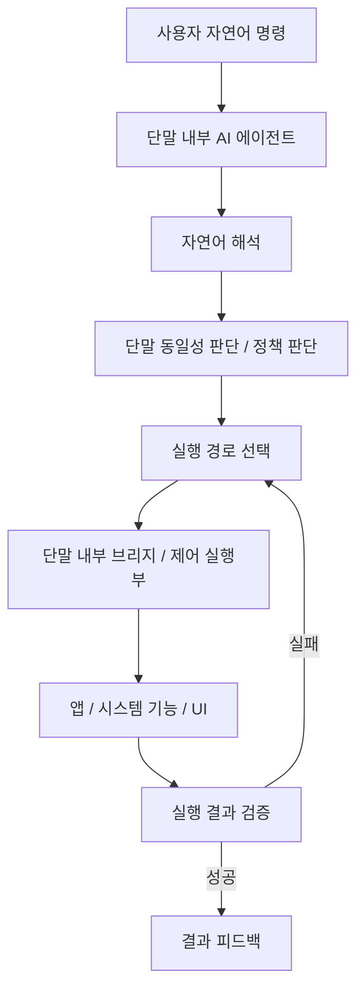

# 직무발명 신고서 초안 v5

## 발명의 명칭
- **국문:** 온디바이스 인공지능 에이전트를 이용한 자연어 기반 자기 단말 제어 장치 및 방법
- **영문:** Apparatus and Method for Natural Language-Based Self-Device Control Using an On-Device Artificial Intelligence Agent

---

# 1. 발명의 배경

## 가. 본 발명의 기술분야
본 발명은 모바일 단말 내부에서 실행되는 인공지능 에이전트가 사용자의 자연어 명령을 해석하고, 그 해석 결과를 이용하여 동일 모바일 단말의 애플리케이션, 운영체제 기능 및 시스템 설정을 직접 제어하는 기술에 관한 것이다. 보다 구체적으로는, 본 발명은 온디바이스 인공지능(On-device AI), 자연어 처리(Natural Language Processing), 모바일 자동화(Mobile Automation), 운영체제 인터페이스 제어, 로컬 실행 환경, 디버깅 브리지 기반 제어, 실행 결과 검증 및 실패 시 재시도 제어를 포함하는 자기 단말 제어 기술에 관한 것이다.

종래의 모바일 자동화 기술은 대체로 외부 개인용 컴퓨터, 서버 또는 별도 제어 장치가 모바일 단말을 제어하는 구조를 전제로 하거나, 사용자가 미리 정의한 스크립트, 매크로 또는 접근성 기반 자동화 규칙에 의해 제한적인 반복 작업을 수행하는 구조였다. 또한 일부 음성 비서 또는 자연어 인터페이스가 존재하더라도, 동일 모바일 단말 내부에서 실행되는 인공지능 에이전트가 동일 단말을 직접 제어하고, 제어 결과를 검증한 뒤 실패 시 대체 경로를 선택하여 재시도하는 폐루프 구조는 충분히 제시되지 않았다.

본 발명은 이와 같은 한계를 극복하기 위하여, **동일 모바일 단말 내부에서 실행되는 인공지능 에이전트가 동일 단말을 제어하는 자기 단말 제어 구조**와, **자연어 해석-실행 경로 선택-결과 검증-대체 경로 재선택을 포함하는 폐루프 제어 구조**를 결합한 장치 및 방법을 제안한다.

## 나. 종래기술의 설명

### 1) 종래기술의 목적
종래기술의 목적은 앱 실행, 설정 변경, 정보 조회 또는 반복 동작 자동화를 보다 간편하게 수행하는 데 있다. 이를 위해 외부 호스트 기반 디버깅 인터페이스, 접근성 서비스, 규칙 기반 매크로 및 제한적인 음성 명령 처리 방식이 사용되어 왔다.

### 2) 종래기술의 구성
종래기술은 일반적으로 다음과 같은 구성을 가진다.
- 외부 호스트 또는 서버
- 모바일 단말과 통신하는 디버깅 인터페이스
- 앱 실행 또는 설정 변경을 수행하는 제어 스크립트
- 접근성 서비스 또는 UI 조작 모듈
- 단순 음성 명령 처리 모듈

### 3) 종래기술의 효과
종래기술은 일부 반복 작업을 자동화하거나, 외부 장치를 통해 모바일 단말을 원격 제어할 수 있다는 효과가 있다. 그러나 이러한 기술은 동일 단말 내 AI에 의한 자기 단말 제어, 실행 성공 여부의 검증, 실패 시 대체 경로 재시도까지 포함하는 구조와는 구별된다.

### 4) 종래기술의 문제점
종래기술은 다음과 같은 문제점을 가진다.

첫째, 외부 개인용 컴퓨터 또는 서버 의존성이 높아 동일 단말 단독으로 즉시 활용하기 어렵다.

둘째, 사용자의 자연어 명령을 직접 해석하여 의도와 실행 파라미터를 추출하고, 이를 실시간으로 단말 제어 시퀀스로 변환하는 구조가 부족하다.

셋째, 실행 이후 실제 목표 상태에 도달하였는지를 확인하는 검증 구조가 미흡하다.

넷째, 하나의 실행 경로가 실패하였을 때 다른 제어 수단으로 전환하여 자동 재시도하는 구조가 부족하다.

다섯째, 에이전트가 실행되는 단말과 실제 제어 대상 단말이 동일한지를 판단하고, 그 동일성 판단 결과를 정책 및 실행 경로 선택에 반영하는 구조가 충분히 제시되어 있지 않다.

여섯째, 전화 발신, 메시지 전송, 파일 삭제, 금융 애플리케이션 접근, 시스템 권한 변경과 같은 민감 작업에 대해 체계적인 확인 절차를 제공하지 못한다.

### 5) 종래기술과 본 발명의 차이점
본 발명은 종래기술과 비교할 때 다음과 같은 차이점을 가진다.

1. 동일 모바일 단말 내부에서 실행되는 인공지능 에이전트가 동일 단말을 직접 제어하는 자기 단말 제어 구조를 가진다.
2. 자연어 해석 결과, 단말 동일성 판단 결과 및 정책 판단 결과를 결합하여 실행 경로를 선택한다.
3. 실행 결과를 검증하고, 목표 상태 미도달 시 대체 경로를 선택하여 재시도하는 폐루프 제어 구조를 가진다.
4. 운영체제 API, 시스템 인텐트, 접근성 기반 UI 제어, 디버깅 브리지 기반 셸 명령 등 복수의 실행 경로를 선택적으로 사용할 수 있다.
5. 민감 작업에 대해서는 사용자 확인 또는 인증 절차를 요구할 수 있다.
6. 복합 자연어 명령을 복수의 하위 작업으로 분해하여 순차적 또는 부분 병렬적으로 처리할 수 있다.

---

# 2. 발명(고안)의 구체적 설명 – 대표 실시예

## 가. 발명의 핵심 포인트
본 발명의 핵심은 다음의 두 축으로 요약될 수 있다.

### 핵심 포인트 A: 동일 단말 내부 AI에 의한 자기 단말 제어 구조
인공지능 에이전트가 실행되는 모바일 단말과 실제 제어 대상이 되는 모바일 단말이 동일함을 판단하고, 그 판단 결과를 이용하여 제어 정책, 실행 경로 우선순위 및 사용자 확인 절차를 결정하는 구조를 가진다.

### 핵심 포인트 B: 검증 기반 폐루프 제어 구조
자연어 명령 해석 결과를 토대로 하나 이상의 실행 경로를 선택하여 제어를 수행한 뒤, 목표 상태 도달 여부를 검증하고, 실패 시 대체 경로를 재선택하여 재시도하는 폐루프 제어 구조를 가진다.

상기 핵심 포인트에 따라, 본 발명은 단순한 매크로 또는 일회성 명령 전달 기술이 아니라, 동일 단말 내 AI 기반 자기제어와 검증 기반 재실행 구조가 결합된 기술적 수단으로 구현된다.

## 나. 발명의 구성 요소

### 1) 시스템 구성도
본 발명의 대표 실시예에 따른 자연어 기반 자기 단말 제어 시스템은 다음의 구성요소를 포함할 수 있다.

- **100: 자기 단말** — 인공지능 에이전트가 실행되고 동시에 제어 대상이 되는 모바일 단말
- **110: 입력부** — 사용자의 텍스트 또는 음성 명령을 수신하는 구성
- **120: AI 에이전트 실행부** — 전체 제어 흐름을 관리하는 구성
- **130: 자연어 해석부** — 사용자 명령으로부터 의도 및 실행 파라미터를 추출하는 구성
- **140: 단말 동일성 판단부** — 에이전트 실행 단말과 제어 대상 단말의 동일성을 판단하는 구성
- **150: 정책 판단부** — 명령의 민감도와 보안 요구 수준을 판단하는 구성
- **160: 실행 경로 선택부** — 단말 동일성 판단 결과, 단말 상태 및 정책 판단 결과에 기초하여 실행 경로를 선택하는 구성
- **170: 브리지부** — 로컬 브리지, 무선 디버깅 브리지 또는 이에 준하는 명령 중계 수단
- **180: 제어 실행부** — 선택된 경로를 통해 앱 실행, 시스템 설정 변경 또는 사용자 인터페이스 조작을 수행하는 구성
- **190: 실행 결과 검증부** — 목표 상태 도달 여부를 검증하는 구성
- **200: 대체 경로 선택부** — 검증 실패 시 대체 경로를 선택하여 재실행하는 구성
- **210: 권한 및 보안 관리부** — 민감 작업에 대한 사용자 승인 또는 인증 절차를 수행하는 구성

상기 단말 동일성 판단부(140)는 에이전트가 실행되는 단말과 실제 제어 명령이 적용될 대상 단말이 동일한지를 판단하고, 상기 판단 결과에 따라 정책 판단부(150) 및 실행 경로 선택부(160)가 서로 다른 정책 또는 우선순위를 적용하도록 할 수 있다. 예를 들어, 동일 단말로 판단되는 경우에는 자기 단말 전용 제어 정책을 적용하고, 동일성이 불확실한 경우에는 제한 모드 또는 추가 확인 절차를 적용할 수 있다.

### 2) 기본 동작 순서도
본 발명의 대표 실시예는 다음 단계로 수행될 수 있다.

- **【S100】 사용자 자연어 명령 수신**
- **【S200】 자연어 명령 해석 및 실행 파라미터 추출**
- **【S300】 에이전트 실행 단말과 제어 대상 단말의 동일성 판단 및 단말 상태 확인**
- **【S400】 민감 작업 여부 및 정책 판단**
- **【S500】 실행 경로 선택**
- **【S600】 단말 제어 수행**
- **【S700】 실행 결과 검증**
- **【S800】 목표 상태 도달 여부 판단**
- **【S900】 미도달 시 대체 경로 선택 및 재실행**
- **【S1000】 성공 또는 최종 실패 결과 피드백 제공**

각 단계의 입력/출력은 다음과 같이 정리될 수 있다.
- S100 입력: 텍스트/음성 명령, 출력: 원시 명령 데이터
- S200 입력: 원시 명령 데이터, 출력: 의도, 개체, 실행 파라미터, 신뢰도
- S300 입력: 의도, 실행 파라미터, 출력: 단말 동일성 판단 결과, 단말 상태 정보
- S400 입력: 의도, 단말 상태, 동일성 판단 결과, 출력: 민감도, 확인 필요 여부, 정책 결과
- S500 입력: 의도, 상태, 정책 결과, 동일성 판단 결과, 출력: 선택된 실행 경로
- S600 입력: 실행 경로, 제어 파라미터, 출력: 제어 결과 상태 정보
- S700 입력: 제어 결과 상태 정보, 출력: 성공/실패 판단 결과 및 실패 원인 정보
- S900 입력: 실패 판단 결과, 실패 원인 정보, 과거 실행 결과, 출력: 대체 경로 및 재실행 명령

### 3) 복합 명령 처리 예시
사용자가 “메시지 보내고 7시에 알람 맞춰줘”와 같은 복합 자연어 명령을 입력하면, 자연어 해석부는 이를 복수의 하위 작업으로 분해한다. 예컨대 제1 하위 작업은 메시지 전송, 제2 하위 작업은 알람 생성으로 정의될 수 있다. 이후 각 하위 작업은 독립적으로 실행 경로 선택, 제어 수행, 결과 검증 및 재시도를 거칠 수 있다.

### 4) 구현 예시
본 발명은 다음과 같은 구체적 실시 형태로 구현될 수 있다.
- 자연어 명령에 따라 특정 애플리케이션을 실행하는 경우
- 설정 화면으로 이동하여 특정 시스템 옵션을 변경하는 경우
- 애플리케이션 패키지를 설치한 후 자동 실행하고, 실행 성공 여부를 검증하는 경우
- 사용자 인터페이스 객체 상태를 확인하여 명령 성공 여부를 판단하는 경우
- 제1 경로에서 실패 시 접근성 기반 경로 또는 브리지 기반 셸 명령 경로로 전환하여 재시도하는 경우

## 다. 발명의 효과
본 발명은 다음과 같은 효과를 가진다.

1. 사용자는 복잡한 메뉴 탐색이나 스크립트 작성 없이 자연어 명령만으로 동일 모바일 단말의 앱 또는 시스템 기능을 제어할 수 있다.
2. 외부 개인용 컴퓨터 또는 별도 제어 장치 없이 동일 단말 내에서 제어가 가능하므로 독립성과 이동성이 향상된다.
3. 검증 기반 폐루프 구조를 통해 제어 성공률과 신뢰성이 향상된다.
4. 동일 단말 여부를 판단하여 정책 및 실행 경로를 차등 적용함으로써 오동작 가능성을 줄일 수 있다.
5. 민감 작업에 대한 사용자 확인 절차를 통해 보안성과 안전성이 향상된다.
6. 복합 명령 처리 및 다중 경로 제어를 통해 응용 범위가 확대된다.

---

# 3. 추가 실시예

## 1) 다양한 입력 형태 관점 실시예
본 발명은 텍스트 입력뿐 아니라 음성, 화면 객체 선택, 이미지 기반 지시, 멀티모달 입력 조합에도 적용될 수 있다. 다만 어떠한 입력 수단을 사용하더라도, 사용자 의도를 추출하여 동일 단말 제어로 연결하고 결과를 검증하는 구조는 동일하게 유지될 수 있다.

## 2) 다양한 실행 경로 관점 실시예
본 발명은 운영체제 API, 시스템 인텐트, 접근성 기반 UI 제어, 로컬 브리지, 무선 디버깅 브리지, 로컬 IPC 또는 이에 준하는 실행 인터페이스를 실행 경로로 사용할 수 있다.

## 3) 다양한 적용 서비스 관점 실시예
본 발명은 메시징, 전화, 시스템 설정, 알람/캘린더, 파일 관리, 브라우저, 앱 설치/실행, 개발자용 테스트 자동화 등 다양한 서비스에 적용될 수 있다.

## 4) 다양한 단말 환경 관점 실시예
본 발명은 스마트폰뿐 아니라 태블릿, 휴대형 산업용 단말, 웨어러블 연동 단말 등으로 확장 적용될 수 있다. 다만 대표 실시예는 스마트폰 기반 모바일 단말을 중심으로 설명한다.

---

# 4. 선행기술 대비 요약 포인트

| 구분 | 종래기술 | 본 발명 |
|---|---|---|
| 제어 주체 | 외부 PC/서버/매크로 | 동일 단말 내부 AI 에이전트 |
| 제어 대상 | 외부 단말 또는 제한된 앱 기능 | 동일 단말 자체 |
| 입력 방식 | 규칙/스크립트/단순 음성 명령 | 자연어 기반 의도 해석 |
| 경로 선택 | 단일 또는 제한적 경로 | 복수 경로 선택 가능 |
| 결과 처리 | 명령 전달 위주 | 목표 상태 검증 포함 |
| 실패 대응 | 수동 재시도 중심 | 대체 경로 자동 재시도 |
| 정책 반영 | 제한적 | 민감 작업 정책/확인 적용 |
| 동일성 판단 | 없음 또는 미약 | 자기 단말 동일성 판단 포함 |

## 선행기술과 본 발명의 아키텍처 비교도
상기 비교표는 항목별 차이를 요약한 것이며, 아래 비교도는 종래기술이 주로 **외부 제어형 구조**를 전제로 하는 반면, 본 발명은 **동일 단말 내부 자기제어형 구조**를 채택한다는 점을 직관적으로 보여준다. 특히 종래기술은 외부 호스트와 모바일 단말이 물리적 또는 무선 연결로 분리되어 있는 반면, 본 발명은 모바일 단말 내부에 인공지능 에이전트가 위치하고, 단말 내부 브리지 및 실행 경로 선택 구조를 통해 동일 단말의 앱, 시스템 기능 및 사용자 인터페이스를 제어한다. 또한 본 발명은 실행 후 결과를 검증하고, 실패 시 대체 경로를 재선택하여 재실행하는 폐루프 구조를 가진다는 점에서 종래기술과 구별된다.

### (1) 선행기술의 외부 제어형 아키텍처

### (2) 본 발명의 동일 단말 내부 자기제어형 아키텍처

### (3) 비교 해설
1. 종래기술은 제어 주체가 외부 장치에 위치하는 경우가 많으나, 본 발명은 제어 주체인 AI 에이전트가 동일 단말 내부에 존재한다.
2. 종래기술은 연결 인터페이스를 통해 단말에 명령을 전달하는 구조가 중심이지만, 본 발명은 단말 내부 브리지와 실행 경로 선택 구조를 이용하여 자기 단말을 직접 제어한다.
3. 종래기술은 명령 전달 이후의 성공 검증 또는 자동 재시도 구조가 제한적인 반면, 본 발명은 검증 및 재시도까지 포함하는 폐루프 구조를 가진다.

---

# 5. 침해 적발 방법
본 발명의 침해는 다음과 같은 방식으로 적발할 수 있다.

1. **기능 테스트 기반 적발**  
   자연어 명령 입력 후 앱 실행, 설정 변경, 메시지 전송, 알람 설정 등 특정 제어가 수행되는지 확인하고, 실패 상황에서 다른 경로로 재시도하는지 확인한다.

2. **사용자 인터페이스 기반 적발**  
   민감 작업 수행 시 사용자 확인 또는 추가 인증 화면이 표시되는지, 복합 명령 수행 시 하위 작업 진행 상태가 표시되는지 확인한다.

3. **로그 및 동작 분석 기반 적발**  
   접근성 이벤트, 시스템 호출 흔적, 포그라운드 앱 변화, 설정값 변경 이력, 브리지 명령 호출 등을 분석하여 해석-판단-실행-검증-재시도 구조를 식별한다.

4. **애플리케이션 구조 분석 기반 적발**  
   앱 패키지 구조, 권한 사용 패턴, 로컬 통신 구조 및 브리지 사용 흔적을 통해 각 기능 모듈의 결합 구조를 확인한다.

---

# 6. 권리청구범위

## [청구항 1] 독립항
동일 모바일 단말 내에서 실행되는 인공지능 에이전트를 이용한 자연어 기반 자기 단말 제어 장치에 있어서,  
사용자로부터 자연어 명령을 수신하는 입력부;  
상기 자연어 명령을 해석하여 의도 및 실행 파라미터를 추출하는 자연어 해석부;  
상기 인공지능 에이전트가 실행되는 단말과 제어 대상 단말이 동일한지 여부를 판단하고 단말 상태를 확인하는 단말 동일성 판단부;  
상기 자연어 해석 결과 및 단말 동일성 판단 결과에 기초하여 민감 작업 여부와 보안 요구 수준을 판정하는 정책 판단부;  
상기 자연어 해석 결과, 단말 동일성 판단 결과 및 정책 판단 결과에 기초하여 복수의 제어 실행 경로 중 적어도 하나를 선택하는 실행 경로 선택부;  
선택된 실행 경로에 따라 상기 모바일 단말의 애플리케이션 또는 시스템 기능을 제어하는 제어 실행부;  
상기 제어 실행부의 수행 결과에 대해 목표 상태 도달 여부를 검증하는 실행 결과 검증부; 및  
상기 실행 결과 검증부가 목표 상태 미도달로 판단한 경우, 이전 실행 실패 정보와 단말 상태를 기초로 대체 경로를 선택하여 상기 제어 실행부로 재실행 명령을 제공하는 대체 경로 선택부를 포함하는,  
자연어 기반 자기 단말 제어 장치.

## [청구항 2] 종속항
청구항 1에 있어서,  
상기 단말 동일성 판단부는 에이전트 실행 환경 정보, 브리지 연결 정보, 로컬 식별 정보, 단말 모델 정보, 운영체제 정보, 권한 상태 및 설치 앱 상태 중 적어도 하나를 이용하여 동일 단말 여부를 판단하는 것을 특징으로 하는 장치.

## [청구항 3] 종속항
청구항 1 또는 청구항 2에 있어서,  
상기 정책 판단부는 전화 발신, 메시지 전송, 파일 삭제, 권한 변경, 금융 애플리케이션 실행, 카메라 또는 마이크 활성화, 앱 설치 또는 삭제 중 적어도 하나를 민감 작업으로 분류하고, 민감 작업에 대해 사용자 확인 또는 인증 절차를 요구하는 것을 특징으로 하는 장치.

## [청구항 4] 종속항
청구항 1 내지 청구항 3 중 어느 한 항에 있어서,  
상기 실행 경로 선택부는 운영체제 API 호출, 시스템 인텐트, 딥링크, 접근성 기반 사용자 인터페이스 제어, 브리지 기반 셸 명령 및 사전 정의된 UI 시나리오 중 적어도 하나를 선택하는 것을 특징으로 하는 장치.

## [청구항 5] 종속항
청구항 1 내지 청구항 4 중 어느 한 항에 있어서,  
상기 실행 결과 검증부는 UI 상태 변화, 포그라운드 앱 상태, 시스템 설정값, 명령 출력값, 접근성 이벤트, 화면 인식 결과 및 파일 상태 변화 중 적어도 하나를 이용하여 목표 상태 도달 여부를 판단하는 것을 특징으로 하는 장치.

## [청구항 6] 종속항
청구항 1 내지 청구항 5 중 어느 한 항에 있어서,  
상기 대체 경로 선택부는 실패 원인, 과거 성공 이력 또는 경로 우선순위 테이블에 기초하여 대체 경로를 선택하는 것을 특징으로 하는 장치.

## [청구항 7] 종속항
청구항 1 내지 청구항 6 중 어느 한 항에 있어서,  
상기 장치는 하나의 자연어 명령을 복수의 하위 작업으로 분해하여 각 하위 작업별로 실행 경로 선택, 결과 검증 및 재시도를 수행하는 것을 특징으로 하는 장치.

## [청구항 8] 종속항
청구항 1 내지 청구항 7 중 어느 한 항에 있어서,  
상기 장치는 동일 모바일 단말 내에서 애플리케이션의 빌드, 설치, 실행 및 테스트 동작 중 적어도 하나를 수행하고, 그 수행 결과를 검증하는 것을 특징으로 하는 장치.

## [청구항 9] 독립항 (방법항)
동일 모바일 단말 내에서 실행되는 인공지능 에이전트를 이용한 자연어 기반 자기 단말 제어 방법에 있어서,  
사용자로부터 자연어 명령을 수신하는 단계;  
상기 자연어 명령을 해석하여 의도 및 실행 파라미터를 추출하는 단계;  
상기 인공지능 에이전트가 실행되는 단말과 제어 대상 단말이 동일한지 여부를 판단하고 단말 상태를 확인하는 단계;  
상기 자연어 해석 결과 및 단말 동일성 판단 결과에 기초하여 정책을 판단하는 단계;  
복수의 제어 실행 경로 중 적어도 하나를 선택하는 단계;  
선택된 실행 경로에 따라 상기 모바일 단말의 애플리케이션 또는 시스템 기능을 제어하는 단계;  
상기 제어 결과에 대해 목표 상태 도달 여부를 검증하는 단계; 및  
목표 상태 미도달 시 대체 경로를 선택하여 재실행하는 단계를 포함하는,  
자연어 기반 자기 단말 제어 방법.

## [청구항 10] 종속항
청구항 9에 있어서,  
상기 재실행 단계는 이전 실패 정보와 단말 상태를 반영하여 상이한 실행 경로를 선택함으로써 수행되는 것을 특징으로 하는 방법.

---

# 7. 도면 첨부(참조)

### 도면 1 — 시스템 구성도

### 도면 2 — 기본 동작 순서도

### 도면 3 — 민감 작업 확인 흐름도

### 도면 4 — 복합 명령 처리 순서도

---

# 8. 신규성/진보성 주장 포인트(핵심 10)
1. 동일 단말 내부에서 실행되는 AI 에이전트 구조
2. 동일 단말에 대한 자기제어(self-device control) 구조
3. 자연어 명령 기반 제어 시퀀스 생성 구조
4. 단말 동일성 판단 결과를 정책 및 실행 경로 선택에 반영하는 구조
5. 복수의 실행 경로 중 적절한 경로를 선택하는 구조
6. 실행 결과 검증 기반 폐루프 제어 구조
7. 실패 시 대체 경로 재선택 및 재실행 구조
8. 민감 작업에 대한 정책 기반 사용자 확인 구조
9. 앱 설치/실행/테스트까지 포함 가능한 자기 단말 운영 구조
10. 외부 PC 없이 모바일 단말 단독으로 수행 가능한 구조
